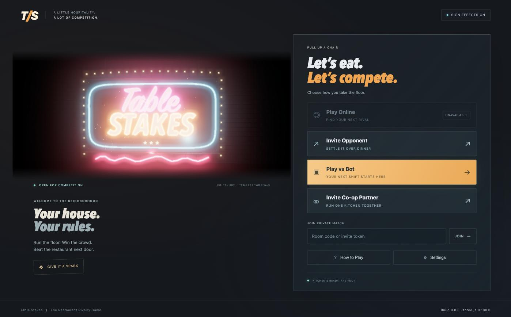
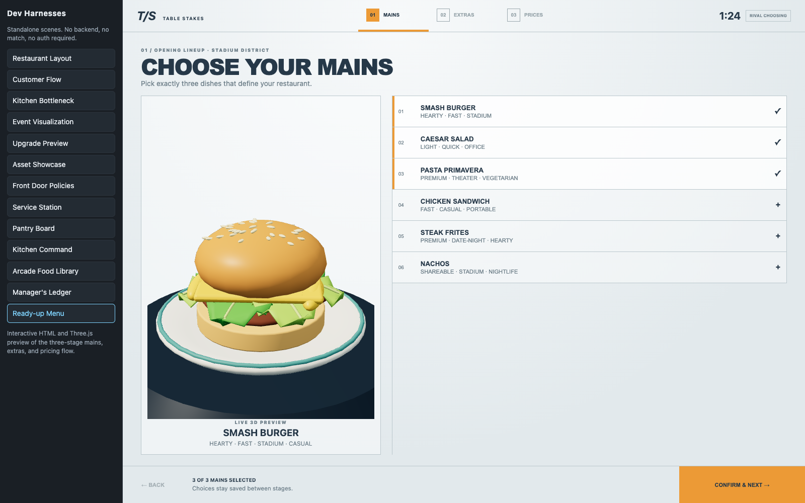
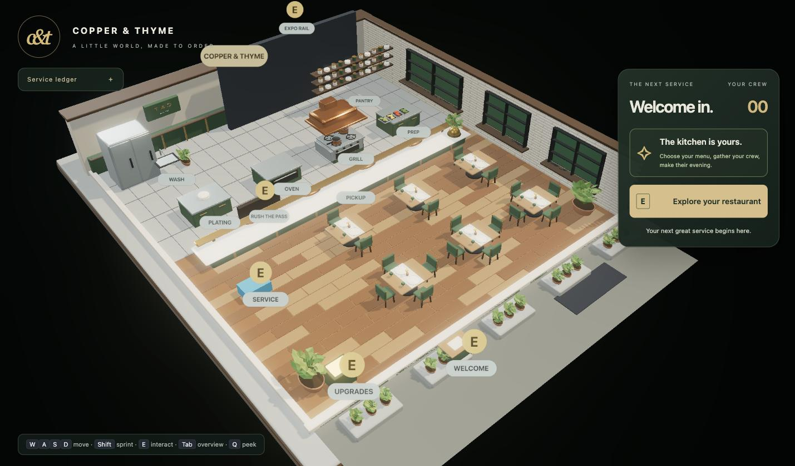
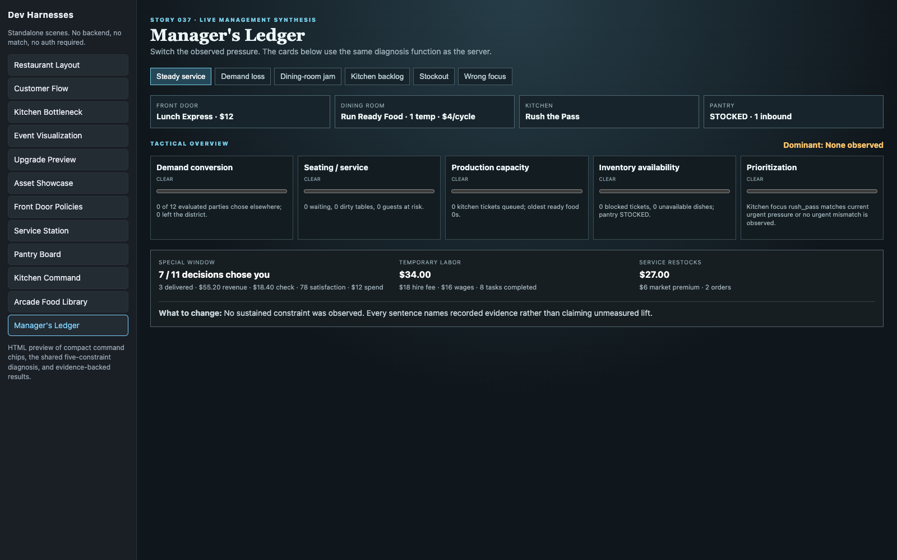
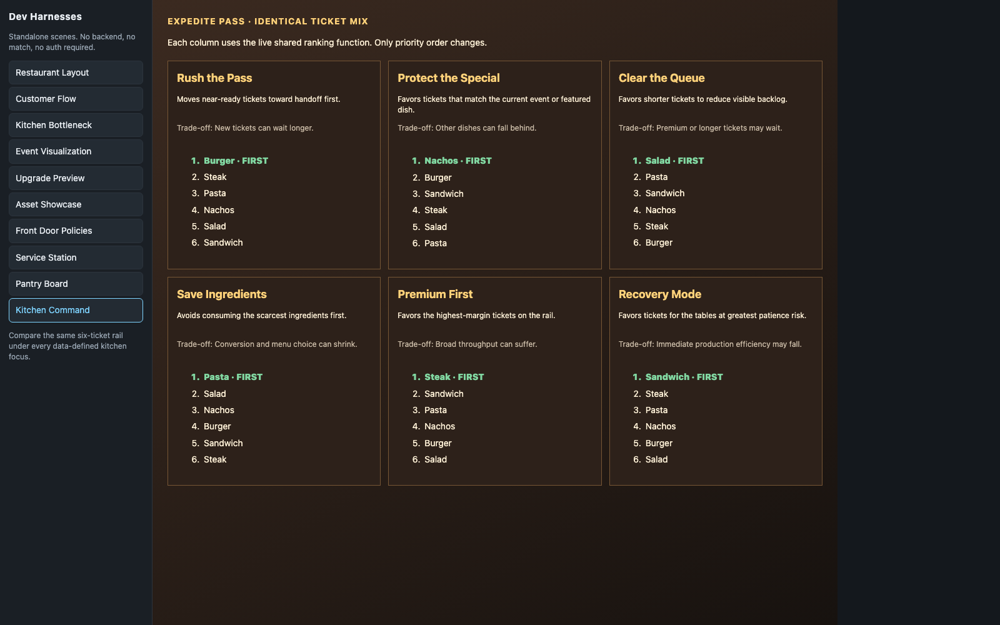

# Table Stakes

### Run the floor. Win the crowd. Beat the restaurant next door.

<p align="center">
  
</p>

A real-time, head-to-head restaurant-management game. Two players each run their own restaurant
in a shared district: a timed setup phase (menu, prices, inventory, staffing, one policy)
precedes a real-time service phase where each player embodies the owner on the floor — seating
parties, expediting the kitchen, and reacting to whatever the shift throws at them, while a
shared pool of customers decides, table by table, who's actually worth walking into.

Full specification: `PRD_ Rival Restaurant — Competitive Service Manage.pdf` (*Rival Restaurant*
was the PRD's working title; the shipped game is branded **Table Stakes**, as seen in the menu
above).

## Status

The original 22-story slice is done, and two further waves have shipped a co-op mode, a full
management layer (kitchen command, front door, service station, pantry, manager's ledger), and a
post-match recap experience — the game runs end to end: customers arrive, choose a restaurant,
are seated, order, are cooked for from finite stock, eat, pay, leave a review, and the match
scores and recaps the result. `docs/kb/stories/index.md` is the live status board — as of this
writing it runs through STORY-059, almost entirely merged or complete, with a handful still
`pending`/`approved`/`pr-opened`. Known open item: a real 1v1 still serves fewer parties per
restaurant than the PRD's target range — see `docs/kb/conventions.md`'s Open Balance Gaps.

## Screenshots

| Setup: build your menu | Live service |
|:---:|:---:|
|  |  |

| Night service | Management layer |
|:---:|:---:|
|  |  |

| Kitchen command |
|:---:|
|  |

## Layout

This is a conventional multi-folder repository, **not** a monorepo framework. Each application
is independently understandable and runnable; the root scripts only coordinate.

| Path | What it is |
|---|---|
| `shared/` | Game data (JSON), wire schemas, and tuning constants used by both sides. Plain `.js` + sibling `.d.ts` — never compiled TypeScript. |
| `server/` | Authoritative Express + `ws` game server. **Plain JavaScript.** Gameplay lives in registered systems under `server/src/game/systems/`, never in `match.js`. |
| `client/` | Browser client: React UI + Three.js scene, pre-match lobby, live HUD/management layer, and the post-match recap flow. **TypeScript.** |
| `harnesses/` | 14 standalone 3D dev scenes exercising individual systems with no backend. **TypeScript.** |
| `assets/` | Models, textures, audio, and mandatory license metadata. |
| `scripts/` | The actual test suite (`check-*.mjs`/`smoke-*.mjs`) plus repo-hygiene checks. |
| `openspec/` | Numbered architectural decisions behind the code, cited by heading throughout the knowledgebase. |
| `docs/kb/` | The project's knowledgebase — architecture, module map, conventions, key files, and sliced stories. Start here to orient. |

## Running it

```bash
npm run install:all      # install server, client and harness dependencies

npm run dev:server       # http://localhost:3000  — API + WebSocket at /ws
npm run dev:client       # http://localhost:5173  — proxies /api and /ws to the server
npm run dev:harnesses    # http://localhost:5174  — needs NO server running
```

Open the client in two browser windows to see two owners in one room. To share a specific
room, pass `?room=room_0001`, or use the in-menu **Invite Opponent** flow for a real invite link.

For a production-shaped run, build the client into the server's static directory and serve
everything from one origin:

```bash
npm run build:client
npm start                # http://localhost:3000 serves the built client
```

## Running the backend on another machine (Docker)

The server serves the API, the WebSocket endpoint and the built client from **one origin**, so
once it is reachable on your network the browser resolves the WebSocket back to the same host
with no client configuration.

```bash
docker compose up -d --build          # build and start
docker compose logs -f server         # follow logs
docker compose down                   # stop
```

Then open `http://<that-host>:3000` from any machine on the LAN. Two browser windows pointed at
the same host land in the same district; add `?room=room_0001` to join a specific room.

If port 3000 is taken on that machine:

```bash
HOST_PORT=8080 docker compose up -d --build
```

Notes:

- The image is multi-stage: the first stage builds the browser client, the runtime stage
  installs **production dependencies only** (`express`, `ws`) and runs as the unprivileged
  `node` user. Three.js is not installed in either stage — the browser fetches it from the
  pinned CDN, so **clients need outbound internet access to that CDN** even when the server is
  on your LAN.
- A `HEALTHCHECK` polls `/health`; `docker compose ps` shows the container as healthy once the
  server is up.
- Match state is in-memory, so there is no volume and a restart drops open rooms by design.

## Checks

There is no test framework — the PRD names none. Verification is by runnable scripts, each
constructing a real `Match` and stepping it, plus the dev harnesses for anything visual.

```bash
npm run check              # everything below, plus both builds — this is CI
npm run check:three        # Three.js pin/bundle rules — see below
npm run check:data         # game-data catalogue integrity and wire-schema shapes
npm run check:lifecycle    # match phases, the clock, reconnect grace, the system seam
npm run check:crowd-density  # measures real district-choice numbers from a live seeded match
```

`npm run check` chains 34 `check-*.mjs` scripts, 5 `smoke-*.mjs` scripts (real sockets, not
in-process), and one measurement script — see `package.json` for the full list, one per system.
Two rules, each learned from a real defect and detailed in `docs/kb/key-files.md`: a new check
**must register every system it integrates with**, and a new check should be **falsified**
(broken on purpose, confirmed red, then restored) before it's trusted.

## The Three.js rule

PRD §13 and §22 make this a pass/fail requirement, and it is the constraint most easily
broken by accident:

- Three.js is loaded **from a pinned CDN via an import map**, never bundled and never an npm
  dependency. `client/index.html` and `harnesses/index.html` map both `three` and
  `three/addons/` to the same pinned version on the same CDN.
- The version is written in exactly one place: `THREE_VERSION` in
  `shared/constants/tuning.js`. Change it there, update both import maps, then run
  `npm run check:three`.
- `@types/three` *is* a devDependency, pinned to the exact same version. It is types only,
  erased at compile time, and never reaches the bundle — the check enforces both the absence
  of a `three` runtime dependency and the exact version match.
- Vite marks `three` external, so the built bundle keeps `from"three"` as a bare specifier
  for the browser's import map to resolve.

## HTTP endpoints

| Endpoint | Method | Purpose |
|---|---|---|
| `/health` | GET | Service health. |
| `/api/version` | GET | Build/client compatibility, including the pinned Three.js version. |
| `/api/markets` | GET | Market definitions, public projection (no `eventPool`). |
| `/api/phases` | GET | The phase presets and their durations, from `tuning.js`. |
| `/api/rooms` | POST | Create a room — `dev`, `solo_bot` (vs. the bot opponent), `private_human`, or `coop` (both players share one restaurant). |
| `/api/rooms` | GET | List room statuses. |
| `/api/rooms/:roomId` | GET | Room status. |
| `/api/rooms/by-invite/:token` | GET | Resolve an invite link — read-only; the actual seat is claimed over the WebSocket. |
| `/api/rooms/:roomId/cancel` | POST | The host calling off an unfilled invite. |
| `/api/rooms/:roomId/log` | GET | The full structured event log for a running or ended match — seed, events, every decision. |
| `/api/rooms/:roomId/summary` | GET | PRD §24 balance figures, derived from the same match. |
| `/api/dev/match` | POST | Development/local match creation — seats **one** player, so the whole lifecycle runs without a second human. |

The game session itself runs over WebSockets at `/ws`, not REST polling.

## Architecture

The two facts that explain most of the code: **the server is authoritative over everything that
matters**, and **gameplay lives in registered systems, never in `match.js`**.

- **The server is authoritative.** The browser never computes money, customer choice, scores,
  inventory, upgrades, or action outcomes. Clients send *intent*; the server integrates, clamps
  and broadcasts.
- **Simulate at 20 Hz, broadcast at 10 Hz**, and interpolate on the client.
- **Gameplay systems register against the tick.** `server/src/game/systems/index.js` lists all
  15, in three loose tiers (core simulation, operations/management, meta/observability).
  Registration order is a documented contract — adding a system is a new file plus one line
  there, never an edit to `match.js`. See `server/src/game/simulation-loop.js`'s block header.
- **Snapshots are built per viewer.** `match_snapshot` puts public state at the top level and
  that player's own state under `you` — PRD §18's rule against revealing an opponent's menu or
  prices has exactly one place to live.
- **React owns UI; Three.js owns the scene.** React re-renders only on a low-frequency status
  callback and never reconciles scene objects per frame — the same seam that lets `harnesses/`
  mount the real `RestaurantScene` with mocked state and no backend.
- **Matches are seeded and reproducible.** Every system that needs randomness takes its own
  named RNG sub-stream via `match.createRngStream(name)`, so one system's draws never shift
  another's sequence.
- **The bot is a real client, not a shortcut.** `server/src/game/bot/bot-socket.js` drives an
  actual WebSocket connection through the same protocol and server authority as a human.

This is the condensed version — for the full picture (a diagram of all 15 systems, the client's
scene/UI/recap layers, and the wire-level data flow), see
[`docs/kb/architecture.md`](docs/kb/architecture.md). The rest of the knowledgebase —
[module map](docs/kb/module-map.md), [conventions](docs/kb/conventions.md), and
[key files](docs/kb/key-files.md) (including the two hazards that have already cost real
work) — is at [`docs/kb/`](docs/kb/index.md).

## Repository conventions

- Base branch is `master`. One story per branch, cut from a freshly pulled master.
- The server stays plain JavaScript; the client, harnesses and shared schemas are TypeScript.
- All balance content is JSON or plain data under `shared/game-data/` — never hardcoded in a
  system. All tunable numbers live in `shared/constants/tuning.js`.
- Data ids and WebSocket message types are `snake_case`; durations are milliseconds with a
  `Ms` suffix.
- Every reused external asset needs license metadata in `assets/licenses/`.

### Copper & Thyme restaurant artwork

The main game and all development harnesses load the adapted Copper & Thyme restaurant.
See [scene integration and authoring](docs/kb/copper-and-thyme-integration.md) for export steps,
asset provenance, runtime behavior and visual checks. In Restaurant Layout, toggle
**Copper & Thyme artwork** to compare it with the procedural fallback.

## License

All rights reserved — see [`LICENSE`](LICENSE). This is not open-source software.
