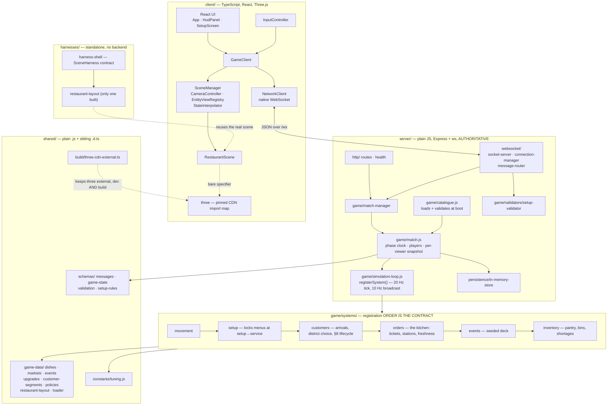

# Architecture — table-stakes

<!-- generated by /kb-generate — last_crawl_commit: 63ac0159104cfc4373ab7e398c425bf55dfbb984 -->

## Overview

*Rival Restaurant* (repo `table-stakes`): a real-time 1v1 competitive restaurant-management
game. Two players run adjacent restaurants competing for **one shared pool of customers**. A
timed setup phase (menu, prices, inventory, staffing, one policy) precedes a real-time service
phase where each player embodies the owner on the floor.

140 files, 47 commits. Four independently runnable applications in one conventional
repository — deliberately **not** a monorepo framework. The server is plain JavaScript; the
client, harnesses and shared type declarations are TypeScript.

Eight of the PRD's 22 sliced stories are merged. The simulation is real: customers arrive,
choose between two restaurants, are seated, order, are cooked for from finite ingredient
stock, eat, pay and leave. Not yet built: worker AI, owner interaction, upgrades, scoring,
results, HUD, visual state language, bot opponent, four of five harnesses, telemetry.

The two architectural facts that explain most of the code: **the server is authoritative over
everything that matters**, and **gameplay lives in registered systems, not in `match.js`**.

## Diagram

## Key Components

**`server/src/game/simulation-loop.js` — the seam everything hangs off.**
`registerSystem({ id, phases?, update(match, dtMs), onPhaseChange? })`. Adding gameplay is a
new file plus one line in `systems/index.js`; nothing edits `match.js`. **Registration order
is a documented contract** — systems run in order every tick, so a later system may rely on an
earlier one having run. Order and its reasoning live in `systems/index.js`.

**`server/src/game/match.js`** owns the seed, phase clock, players and the **per-viewer
snapshot**. `toSnapshot(viewer)` puts public state at the top level and the viewer's own under
`you` — that is what keeps an opponent's menu off the wire. It serializes `<field> ?? []` for
every public array, so a system publishes by attaching its own pre-sanitized array to the
match. Phase transitions carry the deadline forward rather than restarting at "now", so
boundaries don't drift.

**The six systems.** `movement` (owner avatars, server-clamped). `setup` (default menu for a
non-submitter; locks both menus at the phase transition). `customers` (arrivals from a seeded
Poisson process, the shared-district softmax choice, the §8 party lifecycle, satisfaction).
`orders` (tickets walking each dish's `stationSteps`, station queues, freshness on the pass,
revenue). `events` (seeded deck, identical timeline for both players). `inventory` (pantry +
per-station bins, blocking vs unavailable, timed restock).

**`shared/`** carries the wire contract and all balance content. Everything the server imports
is `.js` with a sibling `.d.ts` — the server must never compile TypeScript.

## Data Flow

`POST /api/rooms` → both clients connect to `/ws` → server assigns seed and picks the market
from it → identical **public** market data to both → each submits `setup_submit`, validated
server-side → service begins on readiness or timeout → clients send intent (`player_input`,
`player_ready`); the server integrates, clamps and broadcasts `match_snapshot` per viewer at
~10 Hz → `match_complete`.

A party: enters the district → scores **every** restaurant on public observables (menu fit,
price, projected wait via `match.kitchen.queueDepth()`, reputation, capacity, event affinity)
weighted by its own hidden §6 weights → **softmax, including walking away** → queues → seated
→ orders → the kitchen claims ingredients at the dish's first station step → eats → pays →
review, which feeds a capped reputation EMA. Every choice records a §17 reason on
`match.districtDecisions`.

## External Dependencies

`express`, `ws` (server); `react`, `react-dom`, `vite`, `typescript` (client/harnesses).
`@types/three` is a devDependency pinned to exactly `THREE_VERSION`.

**Three.js is never installed.** It loads from a pinned CDN import map, enforced by
`scripts/check-threejs-pin.mjs` against both `index.html` files, every `package.json`, and the
build output. `shared/build/three-cdn-external.ts` keeps it external in dev *and* build —
`rollupOptions.external` alone covers only the build, and the dev server ignores
`resolveId`'s `external: true`.

In-memory storage only. No database. No test framework.
