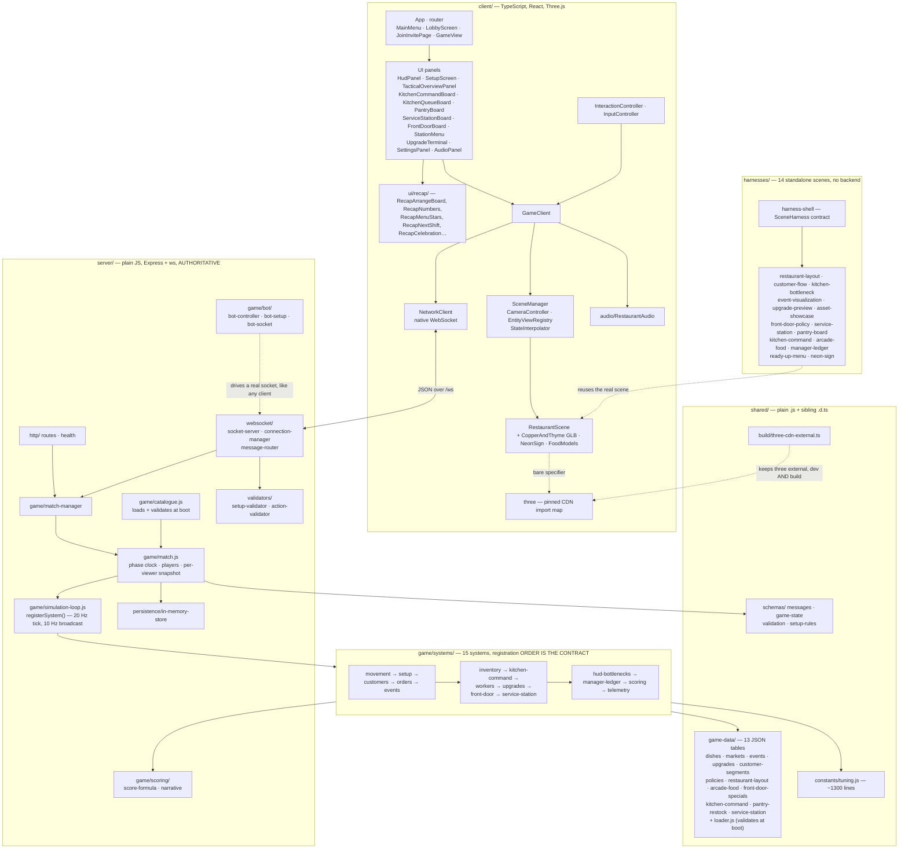

# Architecture — table-stakes

## Overview

*Rival Restaurant* (repo `table-stakes`): a real-time 1v1 (and now co-op) competitive
restaurant-management game. Two players run adjacent restaurants competing for **one shared
pool of customers**. A timed setup phase (menu, prices, inventory, staffing, one policy)
precedes a real-time service phase where each player embodies the owner on the floor.

453 files, 326 commits. Four independently runnable applications in one conventional
repository — deliberately **not** a monorepo framework. The server is plain JavaScript; the
client, harnesses and shared type declarations are TypeScript.

The original 22-story PRD slice is complete and the project has kept going through a second
and third wave (STORY-023 onward) adding co-op mode, a management layer (kitchen command,
front door, service station, pantry/manager ledger), a full post-match recap flow, real
character/food models over a Copper & Thyme scene, and a scene-perf/audio pass. `docs/kb/
stories/index.md` is the live status board — as of this crawl it runs through STORY-059, almost
entirely `merged`/`complete`, with a few `pending`/`approved`/`pr-opened`.

The two architectural facts that explain most of the code are unchanged since the first slice:
**the server is authoritative over everything that matters**, and **gameplay lives in
registered systems, not in `match.js`**. What's grown is the number of systems (6 → 15) and a
client that now has a full pre-match lobby, a live HUD/management layer, and a post-match
recap experience, all driven off the same per-viewer snapshot.

## Diagram

## Key Components

**`server/src/game/simulation-loop.js` — the seam everything hangs off.**
`registerSystem({ id, phases?, update(match, dtMs), onPhaseChange? })`. Adding gameplay is a
new file plus one line in `systems/index.js`; nothing edits `match.js`. **Registration order
is a documented contract** — systems run in order every tick, so a later system may rely on an
earlier one having run. Order and its reasoning live in `systems/index.js`'s block header,
which now documents 15 systems in three loose tiers:

- **Core simulation** (original slice): `movement` → `setup` → `customers` → `orders` →
  `events`.
- **Operations/management layer** (added in the second wave): `inventory` → `kitchen-command`
  → `workers` → `upgrades` → `front-door` → `service-station`. Several of these decorate
  `restaurants[]` and must run after whichever system reassigns that array wholesale each tick
  (`customers`, then `inventory`) — the header comments spell out the exact ordering hazard
  per system.
- **Meta/observability** (runs last): `hud-bottlenecks` → `manager-ledger` → `scoring` →
  `telemetry`. `scoring` MUST be last of the gameplay systems because it reads three
  `onPhaseChange('results')` summaries (`districtSummary`, `orderSummary`, `upgradeSummary`)
  that other systems only populate on their own results-phase transition.

**`server/src/game/match.js`** (717 lines, up from a much smaller original) still owns only
the seed, phase clock, players and the **per-viewer snapshot** — no gameplay. `toSnapshot(viewer)`
puts public state at the top level and the viewer's own under `you`, serializing `<field> ?? []`
for every public array so a system publishes by attaching its own pre-sanitized array.

**`server/src/game/bot/`** drives a bot opponent through a *real* WebSocket connection
(`bot-socket.js`) rather than a shortcut inside `match.js` — the bot experiences the same
message protocol and server authority as a human client, which is what lets solo/dev play
reuse every other system unmodified.

**`server/src/game/scoring/`** splits the score computation (`score-formula.js`) from the
human-readable explanation layer (`narrative.js`) that both the results screen and the recap
flow read from.

**Client scene layer.** `RestaurantScene.ts` has grown to ~2,800 lines and now composites the
adapted **Copper & Thyme GLB** (`client/src/scenes/CopperAndThyme.ts`, loaded over the
procedural scene via the pinned CDN GLTFLoader) with `NeonSign.ts`, `FoodModels.ts`, and
`icon-sprites.ts`. See `docs/kb/copper-and-thyme-integration.md` for the full integration
story. `client/src/audio/RestaurantAudio.ts` is a new layer driven off the same `GameClient`
status stream as the UI.

**`client/src/ui/recap/`** (17 files) is the entire post-match experience — an arrangeable
board of sections (numbers/scorecard, menu-star showcase, next-shift coaching, celebration
animation, pre-reveal teaser) fed by `format.ts`/`catalogue.ts`/`recap-types.ts` off the same
`match_complete` payload the results screen already consumed.

**`shared/`** carries the wire contract and all balance content — now 13 JSON tables under
`game-data/` (up from 8) covering the management layer's own content (front-door specials,
kitchen-command priorities, pantry restock, service-station). Everything the server imports is
`.js` with a sibling `.d.ts`; the server must never compile TypeScript.

## Data Flow

`POST /api/rooms` (or a private invite link, for co-op) → both clients connect to `/ws` →
server assigns seed and picks the market from it → identical **public** market data to both →
each submits `setup_submit`, validated server-side → service begins on readiness or timeout →
clients send intent (`player_input`, `player_ready`, `interact` for owner actions validated by
`action-validator.js`) → the server integrates, clamps and broadcasts `match_snapshot` per
viewer at ~10 Hz → `match_complete`, with a pre-reveal teaser publishing part of the
results-phase payload early to shorten the dark wait → the client's recap flow renders it.

A party: enters the district → scores **every** restaurant on public observables (menu fit,
price, projected wait via `match.kitchen.queueDepth()`, reputation, capacity, event affinity)
weighted by its own hidden §6 weights → **softmax, including walking away** → queues → seated
→ orders → the kitchen claims ingredients at the dish's first station step, ranked by
`kitchen-command`'s active focus and worked by `worker-system` → eats → pays → review, which
feeds a capped reputation EMA. Every choice records a §17 reason on `match.districtDecisions`.

## External Dependencies

`express`, `ws` (server); `react`, `react-dom`, `vite`, `typescript` (client/harnesses).
`@types/three` is a devDependency pinned to exactly `THREE_VERSION`.

**Three.js is never installed.** It loads from a pinned CDN import map, enforced by
`scripts/check-threejs-pin.mjs` against both `index.html` files, every `package.json`, and the
build output. `shared/build/three-cdn-external.ts` keeps it external in dev *and* build —
`rollupOptions.external` alone covers only the build, and the dev server ignores
`resolveId`'s `external: true`.

In-memory storage only. No database. No test framework — see `conventions.md`.
