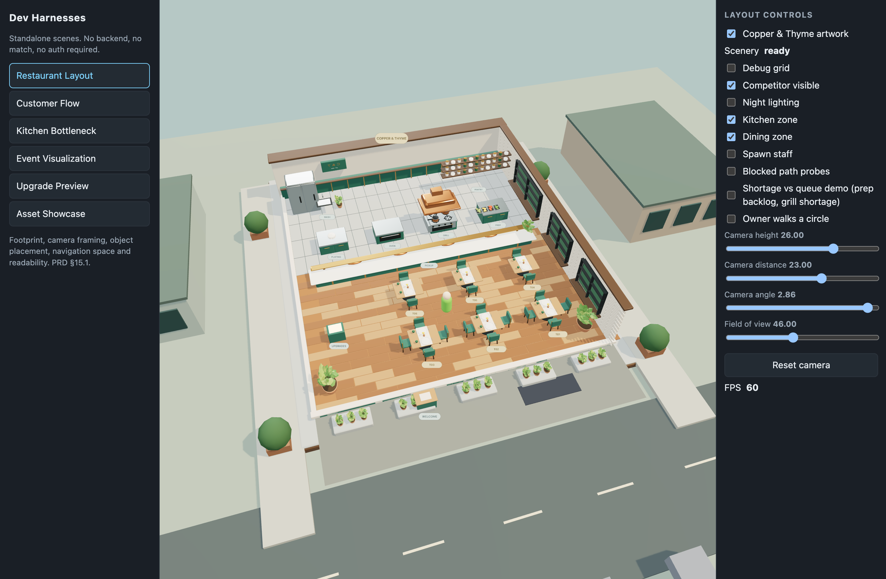
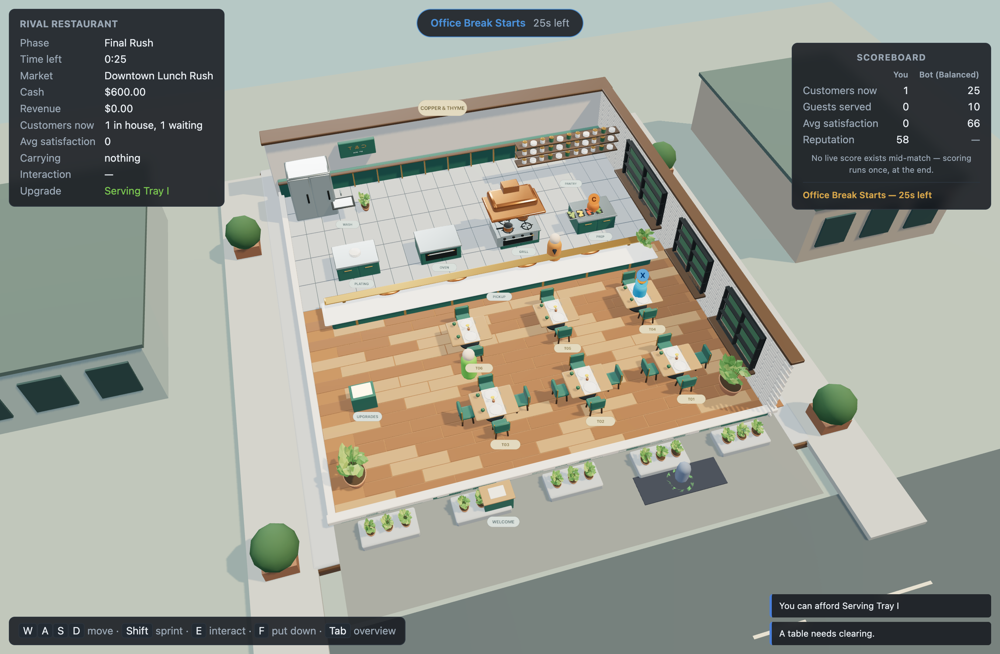

# Copper & Thyme scene integration

The main game and all six harnesses use `RestaurantScene`, which now loads the adapted
Copper & Thyme GLB. The user-supplied `docs/copper-and-thyme.zip` is the original local reference, kept unchanged.
The archive is not required in a checkout: its construction script and the adapted GLB are included under `assets/copper-and-thyme/`.
The reference's demo service logic, fixed customers and permanently ready burgers are excluded.
The authoritative layout, entity ids, movement bounds, stations and rules remain in `shared/`.

## Runtime

- `client/src/scenes/CopperAndThyme.ts` loads the asset through the pinned CDN GLTFLoader.
  Its named furniture roots attach to the existing game entity roots; station indicators,
  table badges, ready dishes, carry state and interaction targets stay on their original paths.
- Vite emits `assets/copper-and-thyme/restaurant.glb` into both client and harness builds.
  Production does not depend on `docs/`, Blender, or a separate model server.
- Loading happens over the playable procedural scene. Failed loads retain that scene;
  disposal during loading prevents late attachment. `sceneryReady` and
  `scene.userData.sceneryStatus` expose readiness to harnesses.
- `restaurant-rendering.ts` gives the game and harnesses the same tone mapping, environment
  reflections and soft shadows. The reference's expensive postprocessing/volumetric demo
  pipeline is not included.
- The camera looks through the open front of the cutaway and follows within a small envelope
  in the main game. WASD is transformed into camera-relative intent before sending it to the
  server. Narrow windows widen the camera's vertical field of view to preserve floor width.
- During service, debug identifiers and the inactive ready button are hidden, the rival
  summary sits at the right edge, and the obsolete development note is replaced by lobby guidance.
- Neutral table ids and station labels identify destinations independently of live state colors.
  The neighboring street is decorative; rival activity continues to come from public snapshots.

## Authoring

`assets/copper-and-thyme/source-build_scene.py` is copied from the supplied archive.
`build-game-scene.py` adapts its construction helpers and furniture to the six-table layout,
exports separate entity roots and batches meshes by material within each root. The GLB is
committed as a source asset; running Blender is only necessary when changing the model.

```sh
/Applications/Blender.app/Contents/MacOS/Blender --background --python assets/copper-and-thyme/build-game-scene.py
npm run check:scenery
npm run build:client
npm run build:harnesses
```

The export check verifies the real GLB's anchors, named roots, size and triangle budget.
It also exercises the production InputController's camera-relative directions, wire bounds,
sprint and release-on-blur behavior.

## Review in harnesses

Run `npm run dev:harnesses` and open `http://localhost:5174/?harness=restaurant-layout`.
Use **Copper & Thyme artwork** to compare the imported model with the procedural fallback.
The **Scenery** readout reports loading, ready or fallback. Existing camera, staff, night,
shortage/queue and grid controls remain available. Kitchen/dining zone controls toggle the
debug floor planes; use the artwork toggle to expose those planes.

Customer Flow, Kitchen Bottleneck, Event Visualization, Upgrade Preview and Asset Showcase
use the same production asset and renderer setup. Asset Showcase reapplies focused visibility
and bounds when the model finishes loading.

## Scope

This integrates the restaurant environment and furniture. Live owners, workers, customers and
food retain the existing state-driven models. It does not implement the pending legibility
stories or replace the game's menus/HUD with the reference's single-order demo interface.
Asset provenance is recorded in `assets/licenses/copper-and-thyme.json`.

## Verification (2026-09-06)

- Full `npm run check` passed, including real HTTP/WebSocket smoke tests.
- Client and harness production builds emit the same 22.1 MB GLB; the export has 129 meshes
  and 508,596 triangles. Three.js and its addons remain external at the existing pinned version.
- The export check was falsified with a temporary GLB missing `table_1`; it failed as expected.
- Browser inspection covered the main game's bot-match scene, layout artwork loading at about
  60 FPS, staff/shortage indicators and a mixed ready-food batch on the imported pass.
- Visual QA also corrected harness camera presets to face the cutaway, and constrained the
  harness grid so long control panels scroll instead of pushing the canvas below the viewport.

The full check suite was rerun successfully on the PR branch after integrating the latest
owner-carry changes from main (PR #32). Artwork on/off, day/night, and harness remounts were
also checked in the browser.

## Screenshots

Captured from the PR branch in Microsoft Edge. These are page screenshots of the actual
Three.js scene, without browser chrome or altered game state.

The layout harness uses the default camera with Copper & Thyme artwork enabled and reports
`Scenery: ready`. Reproduce with `npm run dev:harnesses` and select **Restaurant Layout**.



The main game shows a live **Play vs Bot** match during the final rush. Reproduce with
`npm run build:client && npm start`, then **Play vs Bot → Start Match → Ready up**.


