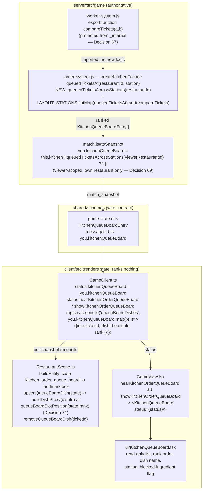

# Design — Kitchen order queue board, with real dish models

Decisions continue the repo-wide numbering (last was Decision 66, `coop-no-staff`).

## Context

`worker-system.js#selectCookTask` already ranks a station's queued tickets with `compareTickets`
(PRD §17 rules 2/3) to pick the AI cook's next move, but that ranking has never been PUBLISHED —
it is computed and consumed entirely server-side, once per worker decision. STORY-042's
`StationMenu.tsx` proved the public snapshot cannot reconstruct it (no `queueAgeMs` on
`OrderSnapshot`; see that file's own header), so a station-local "what to cook" read had to settle
for a patience-only approximation. This change is what STORY-042 could not be: a real,
server-computed, restaurant-wide priority list, published for the first time. See proposal.md -
Why for the co-op motivation.

## Goals / Non-Goals

**Goals:**
- One restaurant-wide ranked ticket list, computed with the SAME comparator the AI cook uses,
  published on the snapshot, viewer-scoped.
- A board entity + fixed-slot real-dish-model pool that renders that list, ranked visually, live.
- Zero duplicated priority math — `compareTickets` has exactly one implementation.

**Non-Goals:**
- Any change to `kitchen_command_board`/`kitchen-command-system.js`'s own focus-directed ranking
  (`rankTicketsForFocus`) — a different, player-chosen policy layer this change does not touch.
- Filtering the board to only "startable" tickets. `selectCookTask` filters out
  `isBlockedNow`/capacity-stalled tickets because it is choosing ONE task for one worker right
  now; this board is answering "what is outstanding", a different question — a blocked ticket is
  still outstanding, so it stays on the board (with `blockedByIngredientId` surfaced) rather than
  silently vanishing the way it would from the AI cook's own candidate list.
- A new action. This board is read-only, same as `kitchen_command_board`'s own board surface
  minus the focus-picking buttons — Decision 2 (server authority) is satisfied trivially, since
  nothing here writes state.
- Capping the published list server-side (see Decision 70).

## Decisions

### Decision 67 — `compareTickets` is promoted from `_internal`-only to a real top-level export

`worker-system.js`'s own header on `_internal` is explicit: "not part of the system's contract,
and no other system or route may import it" — reaching into it from `order-system.js` would
violate that on day one of this change existing. But `compareTickets` (and the `urgencyBucket`
helper it calls) is a pure function over ticket-shaped objects (`queueAgeMs`, `patienceRisk`,
`ticketId`) with no closure over `match`/`state` — nothing about promoting it changes its
behavior or couples it to worker-system.js internals. The fix is therefore not a workaround: change
`function compareTickets(a, b)` to `export function compareTickets(a, b)` at its existing
definition site, leave the `_internal.compareTickets` entry pointing at the same function
reference (so `scripts/check-workers.mjs` is untouched), and have `order-system.js` import the
real export. This change is also the reason the promotion is now justified where it previously
wasn't: PRD §17 rules 2/3 stop being an internal AI implementation detail the moment this change
publishes their exact ordering on the wire — the ranking is now a contract other code (this
board) legitimately depends on, not a test-only peek into private state.

**Alternative considered:** duplicate the two-line comparator in `order-system.js`. Rejected on
its face — the whole point of this change's AC3 ("no new server-side ticket-priority computation
beyond what `compareTickets` already does") is that there is exactly one ranking implementation;
a second copy is exactly the drift AC3 exists to prevent, even if it starts byte-identical.

**Alternative considered:** put the new facade method on `worker-system.js#workerSystem` instead,
since that's where `compareTickets` already lives. Rejected — `workerSystem`'s public export is
shaped as a registered system (`id`, `phases`, `update`, `onPhaseChange`), not a per-restaurant
query facade; every existing "ask about restaurant state" method (`queuedTicketsAt`,
`stationHasCapacity`) already lives on `match.kitchen` (`order-system.js`'s own
`createKitchenFacade`), which is also where the ticket-shaped data this board reads already lives.
Importing the comparator INTO order-system.js (one pure function, no cycle — verified
worker-system.js imports nothing from order-system.js) is a smaller, more conventional dependency
than moving a query method to a file that has never hosted one.

### Decision 68 — the new facade method concatenates `queuedTicketsAt`, unfiltered, across `LAYOUT_STATIONS`

`queuedTicketsAcrossStations(restaurantId)` (`order-system.js`, next to `queuedTicketsAt`) is:
`LAYOUT_STATIONS.flatMap((station) => this.queuedTicketsAt(restaurantId, station)).sort(compareTickets)`.
No `isBlockedNow`/`stationHasCapacity` filtering (see Goals/Non-Goals above) — every field
`queuedTicketsAt` already computes (`blockedByIngredientId` included) passes through unchanged, so
the board can render a "blocked on X" state per entry without this facade computing anything new.

### Decision 69 — `you.kitchenQueueBoard` is scoped exactly like `you.kitchenCommand`

Same reasoning `match.js`'s own `kitchenCommand: this.kitchenCommand?.privateFor(viewerRestaurantId)`
comment gives: this is the viewer's OWN restaurant's kitchen state, and PRD §18/Decision 16 forbid
ever publishing a rival's kitchen internals. `kitchenQueueBoard: this.kitchen?.
queuedTicketsAcrossStations(viewerRestaurantId) ?? []` lives under `you`, defaults to `[]` (an
array, not `kitchenCommand`'s `null`) because "no tickets queued" and "kitchen system not yet
attached" read identically to a board that has nothing to show either way — there is no third
state a consumer needs to distinguish, unlike `kitchenCommand`'s null (which gates an entire
panel on non-null) or `cash`'s null (which means "before upgrades exist" specifically).

### Decision 70 — no server-side cap on the published list

`HUD_CRITICAL_ALERTS_MAX` caps the critical-alerts list because that list is explicitly a ranked
"top N worth interrupting the player for." This board is not that — it is the WHOLE outstanding
queue, and the MVP's 4-station, single-menu kitchen cannot produce a list large enough to be a
real payload concern (worst case: every table's every dish queued at once, still a handful of
entries). A cap here would also read as silently affecting priority (rule 2/3 already exists to
answer "what matters most"; a second, arbitrary truncation on top of it is a second, undocumented
priority rule). The client-side rendering pool is capped instead (Decision 71) — that cap is
about slot geometry, not data.

### Decision 71 — `queueBoardDishes` is a rank-ordered pool, not a held-slot pool like `readyDishes`

`RestaurantScene.ts`'s existing `readyDishes` pool (`claimReadyDishSlot`) claims a slot ONCE per
ticket and holds it for that ticket's whole ready lifetime — deliberately, per its own comment:
"an already-visible dish never jumps sideways just because a NEWER ticket became ready." That
property is the opposite of what this board needs: the board's entire job is to show PRIORITY
ORDER, so slot index must be RANK index, recomputed every snapshot from the already-server-ranked
`you.kitchenQueueBoard` array position — a prop visibly moves toward the front as its ticket rises
in priority, and that motion is the feature, not a bug the way pass-side jumping would be.
Concretely: `GameClient.ts` maps `you.kitchenQueueBoard` to `{..., id: ticketId, rank: index}`
entries (Pattern 4/11 — the client narrows/labels published state, it does not re-rank it) and
`RestaurantScene.ts#upsertQueueBoardDish` positions each prop directly at `queueBoardSlotPosition
(state.rank)`, with no held-claim map. A new local scene constant, `MAX_QUEUE_BOARD_SLOTS = 10`
(not `shared/constants/tuning.js` — this is a rendering-layout number, same category as
`MAX_READY_DISH_SLOTS`, which is also a local scene constant, not a gameplay tunable), caps how
many rank slots exist; a ticket ranked past it is hidden, same "hide past a generous cap rather
than overlap" discipline `MAX_READY_DISH_SLOTS`'s own comment documents. 10 rather than 8
(`MAX_READY_DISH_SLOTS`) because this board's list is restaurant-wide across 4 stations, not one
pass — a broader queue than the busiest single-station approximation another slot count was tuned
against.

### Decision 72 — the board renders in every match, not just co-op

Either choice satisfies AC4 ("either hidden, or a harmless read-only mirror"). This change renders
unconditionally (matching `approach_summary`): a staffed match's board is a truthful, harmless
mirror of PRD §17 rules 2/3 IN THE DEFAULT KITCHEN FOCUS — worth noting explicitly, because
`selectCookTask` actually picks via `match.kitchenCommand?.rankTickets(restaurantId, startable,
compareTickets) ?? startable.sort(compareTickets)`, i.e. under a non-default `kitchen_focus_*`
selection the AI cook can legitimately start a DIFFERENT ticket than this board's own top row
(the focus reprioritizes; this board deliberately does not — see Goals/Non-Goals). The panel's own
copy says "priority order" (PRD §17 rules 2/3), never "what the cook will do next", so the
divergence is not a lie, just a claim this board was never making. Co-op is still the primary
reason this exists (no automated cook to already be acting on the ranking at all), but there is no
reason to hide a truthful read from a staffed match's players too.

## Data Flow

## Risks / Trade-offs

- [Risk] A staffed match under a non-default kitchen focus shows a board whose top row is not what
  the AI cook actually starts next → Mitigation: Decision 72 — panel copy says "priority order",
  never "next pick"; documented explicitly rather than chased in code, since matching
  focus-adjusted ranking here would pull `kitchen-command-system.js` concerns into a board this
  story's own notes say is deliberately NOT a modification of `kitchen_command_board`.
- [Risk] `compareTickets`'s promotion widens `worker-system.js`'s public surface, inviting a future
  import that duplicates OTHER `_internal` logic by the same reasoning. → Mitigation: the new
  export's own comment states the specific test (pure function, no `match`/`state` closure, now a
  published wire contract) so a future reader has to justify the same bar, not just point at this
  precedent.
- [Risk] Two dish-model pools (`readyDishes`, `queueBoardDishes`) both call `buildDishProxy`/
  `buildArcadeFoodProxy` per ticket; a ticket that is both queued AND (impossible — a ticket is
  queued XOR ready/in-progress, `OrderSnapshot.state`/`station` are mutually exclusive with
  `ready`) never double-renders. Noted only because the two pools look similar enough to invite
  the wrong assumption on a future skim.

## Migration / Rollout

No persisted state. The new snapshot field is additive (an old cached client build ignores it,
same rollout story `coop-no-staff`'s own `sharedRestaurant` addition documented); the new layout
entity is additive and `generated: true`, so `check-scenery.mjs` needs no GLB re-export. Nothing
in this change alters `kitchen_command_board`, `StationMenu.tsx`, or any other existing board's
behavior or wire shape.
