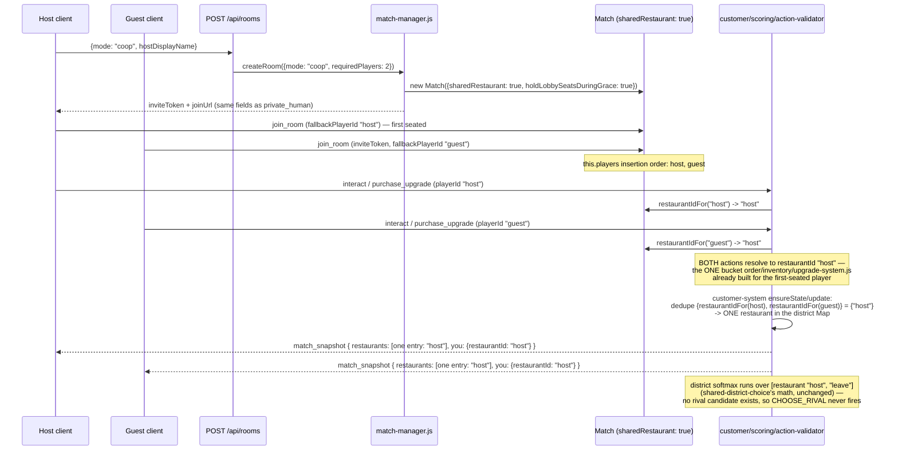

# Design — Co-op match mode and invite entry point

Decisions continue the repo-wide numbering (last was Decision 58).

## Context

`server/src/game/match-manager.js#createRoom` already builds one `Match` per room; `private-
invite-lobby` already gave `mode: "private_human"` a token/`joinUrl`/lobby-hold flow;
`shared-district-choice` already made both restaurants in a match draw from one district pool.
This change does not touch either mechanism — it adds a THIRD `mode` value that reuses the first
verbatim and feeds the second a district with one restaurant instead of two, which that model
already treats as a legitimate case (see Decision 61 below).

The hard part is not the invite flow (that is a two-line `mode` widening). It is that
`restaurantId === playerId` is an assumption baked into essentially every gameplay system in
this codebase — not just the district: `order-system.js`, `inventory-system.js`,
`worker-system.js`, `front-door-system.js`, `service-station-system.js`,
`kitchen-command-system.js`, `upgrade-system.js`, `scoring-system.js`,
`manager-ledger-system.js`, `telemetry-system.js`, and `action-validator.js`'s own
`restaurantId = playerId` all either build one internal bucket per player or resolve which
bucket to act on directly from the acting player's id. A co-op match needs TWO players acting on
ONE bucket. Rewriting every one of those systems to genuinely support N players sharing a
restaurant (staffing, kitchen queueing, who owns which task) is explicitly the "no-staff kitchen
rework" STORY-040+ owns — this change's job is the foundation those stories build on: the
district/scoring/snapshot layer must show ONE restaurant, and any REAL action either seat takes
must land on it, without a rewrite of the systems that are staying single-player-shaped for now.

## Goals / Non-Goals

**Goals:**
- `POST /api/rooms {mode: "coop"}` mints the exact same invite artifacts `private_human` does.
- `match.restaurants` (and everything derived from it — scoring, the results screen, manager
  ledger, telemetry) shows exactly ONE restaurant for a co-op match, never a real one plus a
  phantom all-zero second row.
- A REAL action from EITHER co-op seat (a purchase, an interact) lands on the shared restaurant
  — not a private, never-looked-up bucket keyed by the acting player's own id.
- Every pre-existing mode (dev/private_human/solo_bot) is byte-identical to before this change.
- Nothing that assumes exactly two restaurants (the client's rival-floor remap, the results
  screen's self/rival split, the HUD's rival scoreboard) crashes or renders garbage when there
  is only one.

**Non-Goals:**
- Rewriting `order-system.js`/`inventory-system.js`/`worker-system.js`/`upgrade-system.js`/
  `front-door-system.js`/`service-station-system.js`/`kitchen-command-system.js`'s own internal
  per-restaurant state to be genuinely shared. They keep allocating one bucket per RAW player id
  internally; see Decision 60 for why that is safe to leave alone for this change specifically.
- Co-op scoring/win-condition design (proposal.md's Non-Goals).
- Any staffing/kitchen-queue rework (STORY-040+'s job).

## Decisions

### Decision 59 — `Match#restaurantIdFor(playerId)` is the one seam, not a per-system rewrite

Every restaurant-keyed system reads `restaurantId` from ONE of two shapes today: it enumerates
`match.players.keys()`/`.values()` to build a per-player bucket, or it resolves a single acting
player's own id directly (`action-validator.js`'s `restaurantId = playerId`, `match.js
#toSnapshot`'s `viewer.playerId`). A single method on `Match` — identity unless
`sharedRestaurant` is set, in which case it returns the FIRST-seated player's own id for every
player asked about — lets every one of those call sites make a one-line change (`playerId` →
`match.restaurantIdFor(playerId)`, or de-duplicate an enumeration through it) without any of
them needing to know co-op exists as a concept. `Match` already tracks join order (`this.players`
is a `Map`, insertion-ordered — see `#seat`), so "the first-seated player's id" is free and
requires no new bookkeeping.

**Alternative considered:** a synthetic restaurant id (`coop_<matchId>`) shared by both seats.
Rejected — every LOOKUP-style site (`order-system.js#state.restaurants.get(restaurantId)`,
`inventory-system.js`, `worker-system.js`, ...) only ever finds a bucket that was built by
enumerating `match.players.keys()` with each player's OWN id. A synthetic id would resolve to
`undefined` in every one of those (an order would be un-placeable, a pantry request would fail)
unless every one of those systems' own bucket-construction code were ALSO rewritten — exactly
the "no-staff kitchen rework" this change is deliberately not doing yet. Anchoring the shared id
to an ACTUAL seated player's own id means the untouched systems already have a real bucket under
that key (see Decision 60).

### Decision 60 — Kitchen/inventory/worker/upgrade/front-door/service-station internals are left
### untouched; their orphan per-guest bucket is a deliberate, documented no-op

`order-system.js`, `inventory-system.js`, `worker-system.js`, `upgrade-system.js`,
`front-door-system.js`, `service-station-system.js`, `kitchen-command-system.js` each build
their own `state.restaurants` Map by enumerating `match.players.values()` and keying by
`player.playerId` — one bucket per RAW player, unconditionally, co-op or not. This change does
NOT touch any of them. Because `restaurantIdFor` resolves BOTH co-op seats to the HOST's own
`playerId` (Decision 59), every REAL action (`action-validator.js` resolves `restaurantId`
through the same method before calling into any of these systems) lands on the bucket keyed by
the host's id — the one these systems already built for real. The GUEST's own bucket (keyed by
their own raw id, built the same way it always was) becomes an inert orphan: nothing ever looks
it up again, because nothing calls `state.restaurants.get(guestPlayerId)` once
`action-validator.js` itself resolves through `restaurantIdFor` first. `scripts/check-coop-mode
.mjs` proves this concretely: a purchase from the HOST and a DIFFERENT purchase from the GUEST
both land in `match.upgrades.ownedUpgrades(<shared id>)`, and the guest's own private bucket
(`ownedUpgrades('guest')`) owns neither.

The one place this orphan bucket would otherwise leak into published output — an enumeration
that walked `match.players.keys()` directly instead of going through the resolver — is exactly
what Decision 61 below and the proposal's "Impact" list fix at each site (customer-system,
scoring-system, manager-ledger-system, telemetry-system, `match.js#toSnapshot`'s
`frontDoor`/`serviceStation`/`matchCompleteMessage`).

**Consequence, documented, not silently absorbed:** `customer-system.js#menuOf` reads a
restaurant's menu off `match.players.get(view.playerId)?.setup` — for a co-op restaurant, that
is the FIRST-seated player's own setup submission. The second player's `setup_submit` is still
accepted and stored (nothing rejects it — `setup-system.js`'s own default-fill-in logic runs
identically for both seats) but never read by anything customer-facing. A real collaborative
single-menu flow (both players editing one shared menu, or the second submission being folded
in some other way) is explicitly STORY-040+'s job.

### Decision 61 — The district-choice model's math is UNCHANGED; only the restaurant COUNT it
### sees changes

`shared-district-choice`'s own header already states the degenerate case: "A district with one
restaurant ... is the degenerate case of the same code: one candidate, no rival to compare
against, so `decisionReason` stays null and CHOOSE_RIVAL never fires." `resolveEvaluateRestaurants`
already scores every restaurant the district Map holds (`[...state.restaurants.values()]`) and
runs the SAME softmax over "restaurant" vs. "leave" regardless of how many candidates exist —
with one candidate, `others.length === 0` so `reason` stays `null`, and `DISTRICT_LEAVE_UTILITY`
is still a live alternative in the same draw. This change collapses WHICH restaurant ids
`ensureState`/`update` insert into that Map (Decision 59's resolver, de-duplicated through a
`Set`) — it does not touch `scoreRestaurant`, `softmaxPick`, or `resolveEvaluateRestaurants`
themselves. A party can still walk away from a co-op restaurant it does not like (a badly priced
menu still loses parties to the street, per PRD §24's "should reduce conversion, but not make
the restaurant completely empty") — it simply never loses them to a RIVAL that does not exist.

**Alternative considered:** force every party to the one restaurant unconditionally (bypass the
model for co-op). Rejected per the story's own AC3 wording ("real, playable customer flow") and
because it would special-case co-op inside the district's core loop for no real benefit — the
existing softmax-over-one-candidate-plus-leave already produces exactly that "draw everyone
toward the one restaurant, with a leave option" behavior, for free, as a property of code that
was written for the two-restaurant case and never assumed it.

### Decision 62 — The client learns "which restaurant is mine" from a new wire field, not from
### `playerId`

`GameClientStatus`/every board component (`HudPanel`, `TacticalOverviewPanel`,
`FrontDoorBoard`, `KitchenCommandBoard`, `ServiceStationBoard`, `ResultsPanel`) and
`GameClient.ts`'s own snapshot handling assumed `restaurantId === playerId` throughout — filtering
`customers[]`/`orders[]`, looking up `restaurants[]`/`frontDoor`/`serviceStation` entries, and
deciding whether another player's avatar renders on this floor or the decorative rival one
(`remapToRivalFloor`). A co-op guest's own `playerId` is never a key into any restaurant-keyed
structure once STORY-039 lands server-side, so every one of those sites would either find
nothing (a blank HUD) or find the WRONG thing (the guest's client reading the host's restaurant
back labeled "Rival"). `match_snapshot.you.restaurantId` (this viewer's own resolved id) and
`players[].restaurantId` (every player's own resolved id, so `remapToRivalFloor` can compare
restaurant, not player, identity) are additive wire fields identical to `playerId` for every
pre-existing mode — every read site is a mechanical swap, not new logic.

## Data Flow

## Migration / Rollout

No persisted state to migrate (in-memory rooms, same as every other mode). Additive fields
(`you.restaurantId`, `players[].restaurantId`) mean an old cached client build still functions
against a new server for every pre-existing mode (falls back to `playerId`, which is identical
there); it would mis-render a co-op match's HUD for the guest seat specifically until the client
rebuilds — acceptable, since co-op is a brand-new entry point nobody has a stale bookmark for.
