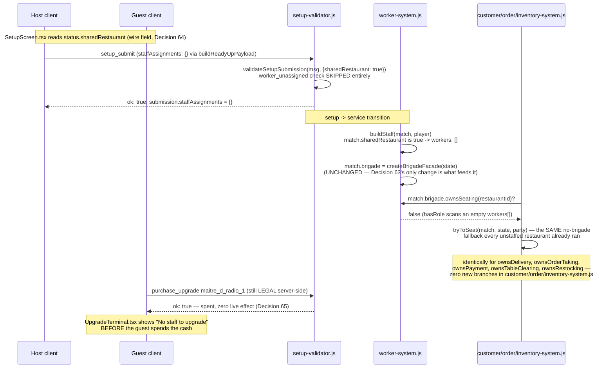

# Design — No automated staff in co-op mode; lock staff-only upgrades

Decisions continue the repo-wide numbering (last was Decision 62, `coop-match-mode`).

## Context

`coop-match-mode`'s design.md (Decision 60) already named the fact this change resolves: every
restaurant-keyed system that builds its OWN internal bucket per raw player id —
`order-system.js`, `inventory-system.js`, `worker-system.js`, `upgrade-system.js`,
`front-door-system.js`, `service-station-system.js`, `kitchen-command-system.js` — was left
untouched by that story, on purpose, because `restaurantIdFor` already routes every REAL action
onto the first-seated player's bucket (the one these systems build for real; the second seat's
own bucket is a documented, harmless orphan). That decision is why this story does not need to
touch `order-system.js`, `inventory-system.js`, `upgrade-system.js`, or any of the front-
door/service-station/kitchen-command systems at all — they already read `match.brigade?.owns*()`
defensively and already do the right thing for a restaurant with an empty `workers[]`. This
change's entire footprint is: make `worker-system.js#buildStaff` actually PRODUCE an empty
`workers[]` for a co-op restaurant, and make the setup pipeline that feeds it (`ready-up-
menu.js`, `setup-validator.js`) stop treating "every roster worker needs a post" as a universal
rule.

## Goals / Non-Goals

**Goals:**
- `worker-system.js#buildStaff` produces `workers: []` for a `sharedRestaurant` match, and every
  `match.brigade.owns*()` question is `false` for it as a direct, mechanical consequence (no new
  branch in `createBrigadeFacade` itself).
- The setup pipeline (`ready-up-menu.js`, `setup-validator.js`, `defaultSubmission`) treats an
  empty roster as a LEGAL, intentional state for a co-op restaurant, not an incomplete
  submission — for both a real player's submission and the idle-player fallback.
- Every `owns*()`-gated fallback (auto seating, seated-party auto-greet/order-taking, order-pass
  teleport hand-off, auto payment collection, table-clearing auto-resolve, auto-dispatched
  restocking) is PROVEN correct for a co-op restaurant against a real running `Match`, not
  inferred from reading the code.
- The one upgrade whose effect only matters with automated staff is locked in the upgrade
  terminal with a stated reason, not hidden or silently purchasable-but-inert.

**Non-Goals:**
- Rewriting any of the per-player bucket construction `coop-match-mode`'s Decision 60 already
  left alone. A co-op restaurant takes the exact same "no brigade" branch an unstaffed restaurant
  in ANY mode already takes — this change does not invent a co-op-specific code path anywhere
  except the three files that decide the roster's SIZE (`buildStaff`, `buildReadyUpPayload`,
  `validateSetupSubmission`).
- Timed-cooking UI, station indicators, or a kitchen queue board — later stories in the PRD's
  co-op slice.
- Removing, renaming, or re-balancing any upgrade. The audit (Decision 65) either leaves an
  upgrade exactly as purchasable as before, or locks it in the UI with a reason; nothing is
  deleted from `upgrades.json`.

## Decisions

### Decision 63 — `buildStaff` is gated on `match.sharedRestaurant`, not on roster content

`worker-system.js`'s `ROSTER` is a module-level constant read once from
`restaurant-layout.json`'s `staff.roster` — it is the same array for every restaurant in every
match, and this change does not touch the layout file (the roster stays the mandatory list every
OTHER mode requires). The gate is therefore on the MATCH, not on the layout: `buildStaff(match,
player)` returns `workers: []` when `match.sharedRestaurant` is true, and the normal
`ROSTER.map(...)` otherwise. Because `sharedRestaurant` is set match-wide by
`match-manager.js#createRoom({mode: 'coop'})` (`coop-match-mode`'s own Decision 59/`isCoop`
plumbing) and never mixed with a rostered restaurant inside one match, this one boolean is
sufficient — there is no scenario where one restaurant in a match should have a roster and
another should not.

**Alternative considered:** an empty `staff.roster` in a second, co-op-specific layout file.
Rejected — `ROSTER` is read once at module load, before any match exists, so it cannot vary
per-match without threading the layout choice through `buildStaff`'s caller chain (`ensureState`,
`ensureState`'s own caller in `update`/`onPhaseChange`) for a distinction the match itself already
carries for free. It would also require `setup-validator.js` and `ready-up-menu.js` to pick a
DIFFERENT layout for co-op, duplicating every dish-producibility/station fact `restaurant-
layout.json` states about `compact_mvp` into a second file that must be kept in sync by hand.

### Decision 64 — `match_snapshot.sharedRestaurant` is public, not under `you`

The client needs to know a match is co-op in two places: `SetupScreen.tsx` (to build an empty
`staffAssignments` via `buildReadyUpPayload`) and `UpgradeTerminal.tsx` (to lock the staff-only
upgrade). Both facts are true IDENTICALLY for both co-op seats — unlike `you.setup`, there is no
privacy reason to scope it per-viewer, and unlike `you.restaurantId` (STORY-039's own field,
which genuinely differs in VALUE between a co-op host and guest even though both resolve through
the same method), `sharedRestaurant` is one boolean the whole match agrees on. It is therefore a
top-level field on `match_snapshot`, alongside `matchPhase`/`market` — the same publicness
reasoning `match.js#toSnapshot`'s own comment gives for those fields — populated straight from
`Match#sharedRestaurant` (already set at construction by `coop-match-mode`, nothing new to
compute).

**Alternative considered:** derive "am I co-op" on the client from `you.restaurantId !==
you.playerId`. Rejected — that comparison is already how the client detects "I am a co-op GUEST
specifically" for `remapToRivalFloor`, but the co-op HOST's own `restaurantId === playerId`
(STORY-039: `restaurantIdFor` returns the first-seated player's OWN id), so the comparison reads
`false` for the host — exactly backwards for a fact ("this restaurant has no roster") that is true
for BOTH seats. A dedicated field says what it means; a derived comparison here would be
importing a coincidence.

### Decision 65 — The staff-only upgrade audit: one lock, everything else stays purchasable

`upgrade-system.js#KNOWN_EFFECT_KEYS` names ten effects with a live read site (the other six
`upgrades.json` entries — `prep_counter_1`, `server_radio_1`, `additional_table_1`,
`maintenance_plan_1`, `complimentary_snacks_1` — are already `effect_not_implemented` for every
mode, not a co-op-specific concern, and already excluded from `UpgradeTerminal` by its own
existing `WIRED_UPGRADE_IDS` filter). Each of the ten wired effects was traced to its actual read
site:

| Upgrade | Effect key | Read site | Staff-gated? |
|---|---|---|---|
| `serving_tray_1/2` | `ownerCarryCapacity` | `match.js#toSnapshot`, `action-validator.js` carry-capacity check | No — the OWNER's own capacity |
| `faster_grill_1` | `stationSpeedMultipliers` | `order-system.js#stationSpeedMultiplier` | No — a property of the station, whoever tends it (`worker-system.js`'s own header: "STATION CONCURRENCY... equipment, not hands") |
| `better_seating_1` | `seatedPatienceMultiplier` | `customer-system.js` patience decay | No — a customer-side timer |
| `pantry_shelves_1` | `restockTravelTimeMultiplier` | `inventory-system.js#restockDurationMs` | No — that function's own comment: "the call STORY-007's worker and STORY-008's owner both make"; the owner's manual restock gets the same discount |
| `host_stand_toolkit_1` | `seatingProcessMultiplier` | `customer-system.js` host-stand queue delay | No — gates the queue timer itself, not a worker's task duration |
| `street_signage_1` | `undecidedConsiderationBonus` | `customer-system.js` district utility | No — front-door customer math |
| `queue_pager_1` | `queuePatienceMultiplier` | `customer-system.js` patience decay | No — customer-side |
| `guest_recovery_kit_1` | `recoveryPatienceMultiplier` | `customer-system.js` manager recovery | No — a manager (player) action |
| `maitre_d_radio_1` | `serverSeatingDurationMultiplier` | `worker-system.js` `selectServerTask`/`selectHostTask`'s `workDuration(state, 'seat_party', ...)` — ONLY | **Yes** |
| `window_display_1` | `activeSpecialVisibilityMultiplier` | `customer-system.js` special visibility | No — front-door customer math |

`maitre_d_radio_1` is the one entry whose ENTIRE effect is a multiplier on a worker task's
duration in `worker-system.js` — it is never read anywhere else. In a co-op restaurant
(`workers: []` per Decision 63) that task never runs, so the multiplier applies to nothing: a
legal purchase that spends real cash for zero effect. That is exactly the "wonder if it's a bug"
outcome this story's own acceptance criteria calls out, so `UpgradeTerminal.tsx` locks it — a new
`STAFF_ONLY_UPGRADE_IDS` list, checked against `sharedRestaurant`, rendering "No staff to
upgrade" instead of a Buy button — rather than leaving it purchasable-but-inert or silently
removing it from the list (which would read as a bug in the other direction: "why did an upgrade
I could afford disappear").

**Server-side purchase stays legal.** This is a UI-only lock, deliberately: `maitre_d_radio_1`
being dead weight in co-op is not an illegality (it does not corrupt state, unlock something it
shouldn't, or desync client and server) the way every OTHER `setup-validator.js`/`action-
validator.js` rule is — it is purely a "this won't do what you think" fact the UI should
communicate. `Milestone 0 Decision 2` ("everything disabled here is disabled for UX only, the
server re-derives every rule") governs rules that keep a match LEGAL; nothing about a co-op
player choosing to buy a upgrade with no effect makes the match illegal, so there is no matching
server-side rejection to add.

**Confirmed not bypassable through a second read site.** `maitre_d_radio_1` also appears in
`GameClient.ts`'s `FRONT_DOOR_UPGRADE_IDS` list — checked, because a second UI surface offering
the same purchase would make the terminal's lock cosmetic. That list is read in exactly two
places, `HudPanel.tsx` and `TacticalOverviewPanel.tsx`, both filtering `status.purchasedUpgradeIds`
to render an "owned" badge — display of upgrades ALREADY bought, never a purchase affordance.
`FrontDoorBoard.tsx` itself has no upgrade-purchase code at all. `UpgradeTerminal.tsx` is the
only place `onBuy`/`buyUpgrade` is wired to an upgrade id, so it is also the only place that
needs the lock.

**Future-proofing note for whoever wires `server_radio_1`.** Its `serverTargetingQuality` effect
("the server picks better targets and wastes fewer trips") is, by its own description, exactly as
staff-only as `maitre_d_radio_1` — but it is not in `KNOWN_EFFECT_KEYS` yet, so it is invisible to
`UpgradeTerminal` today (`WIRED_UPGRADE_IDS` excludes it) and this audit has nothing to lock. The
story that wires it should add its id to `STAFF_ONLY_UPGRADE_IDS` in the same change, not treat
that as a separate follow-up — `GameClient.ts`'s own comment beside the constant says so.

### Decision 66 — "Clear Table" becomes a dead verb for a co-op player, and that is the correct
### consequence of preserving the existing fallback, not a gap in this change

This story's own framing is that co-op players "personally seat parties, take orders, deliver
food, clear tables, and cook" — but `customer-system.js#freeTable` only sets `table.dirty` (and
thus gives `action-validator.js#resolveClearTable` anything to act on) when
`match.brigade?.ownsTableClearing(...)` is true. For a co-op restaurant that is never true
(Decision 63), so a table is never dirtied in the first place: it auto-resolves straight back
into rotation the instant a party leaves, exactly like an unstaffed restaurant in ANY mode
already does today (`scripts/check-coop-no-staff.mjs`'s "AUTO TABLE CLEARING" check proves this).
The practical consequence is that a co-op player's own manual "Clear Table" interact
(`action-validator.js#resolveClearTable`) has nothing to ever find dirty and clear — the verb
exists on the controller but never fires in co-op.

This is the correct behavior under this story's own AC ("co-op without a human doing a given job
should behave exactly like an unstaffed restaurant already does today, not silently freeze") —
freezing would be a table that STAYS dirty with nobody to clear it; auto-resolving is the
documented fallback every other unstaffed duty gets. It is recorded here explicitly, rather than
left for a future reader to discover, because it is the one place where the story's own
"personally... clear tables" framing and the actual shipped behavior diverge: co-op players
personally seat, order-take, deliver, and cook, but never clear a table, because tables never
need it. Fixing that (making a co-op restaurant's tables get dirty and giving the players
something to clear) would be a real gameplay change belonging to a future story, not a bug this
one introduced.

## Data Flow

## Migration / Rollout

No persisted state to migrate. `sharedRestaurant` defaults to `false` on `buildReadyUpPayload`
and `validateSetupSubmission`'s options, and `Match#sharedRestaurant` already defaults to `false`
(`coop-match-mode`), so every pre-existing mode is byte-identical: full roster, every `owns*()`
true where staffed, `worker_unassigned` still rejects an incomplete submission, every upgrade
purchasable exactly as before. The new `match_snapshot.sharedRestaurant` wire field is additive —
an old cached client build simply never reads it, same rollout story `coop-match-mode`'s own
`you.restaurantId` addition documented.
