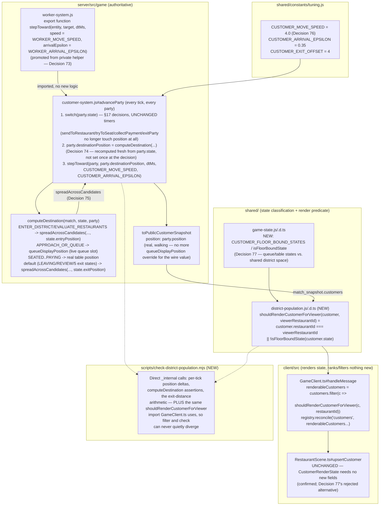

# Design — Real per-tick district movement and full-population rendering

Decisions continue the repo-wide numbering (last was Decision 72, `coop-kitchen-queue-board`).

## Context

`customer-system.js`'s state machine (`advanceParty`, called every tick from
`customerSystem.update`) is TIME-based (`msInState` thresholds) and must stay that way — see
proposal.md's Why and `openspec/changes/shared-district-choice/proposal.md`, which this change
does not touch. Before this change, five call sites inside that same file set `party.position`
directly the instant a §17 decision was made: `spawnParty` (birth, correctly instant),
`collectPayment`, `sendToRestaurant`, `tryToSeat`, `exitParty`, and a `PAYING`-state inline
duplicate of `collectPayment`'s own three lines. No per-tick integration existed anywhere in this
file — the worker/owner systems have had one (`worker-system.js#stepToward`) since early in the
project.

On the client, `GameClient.ts`'s `handleMessage` filters `message.customers` to
`c.restaurantId === restaurantId` before ever calling `EntityViewRegistry.reconcile('customers',
...)`, which is `RestaurantScene.ts#upsertCustomer`'s only way to learn about a party. That filter
exists for a real reason, documented on the line itself: both restaurants in a match share one
`restaurant-layout.json`, including literal table AND queue ids/coordinates, so an unfiltered
reconcile would render the rival's queued or seated party on top of this viewer's own furniture.

## Goals / Non-Goals

**Goals:**
- Every party's rendered `position` is reached by real per-tick integration against a named
  speed, never a jump — for the walk toward a chosen restaurant, the walk to a table, and the
  walk back out, including for a party that never chooses one at all.
- Every party in genuinely shared, restaurant-agnostic district space (deciding, or already
  gone) renders for BOTH viewers, regardless of which restaurant it is/was assigned to.
- Reuse `worker-system.js`'s existing `decide()`-instant / `stepToward()`-per-tick split rather
  than inventing a second movement model.

**Non-Goals:**
- Any change to the choice model (`scoreRestaurant`, `softmaxPick`, `resolveEvaluateRestaurants`'s
  own decision logic) — `shared-district-choice`'s requirements are untouched.
- Rendering a rival restaurant's full, individually-walking population on the OTHER viewer's own
  floor. `RestaurantScene.ts` already has a mechanism for this class of problem
  (`upsertOwner`'s `remapToRivalFloor` linearly remapping a rival owner avatar's local
  coordinates onto `buildCompetitor`'s decorative shell) — considered and rejected for
  customers here; see Decision 77.
- Co-op mode (`sharedRestaurant`, `worker-system.js`'s co-op branch) — unrelated to this change,
  not touched.
- Any new visual treatment beyond a real character model walking to a real destination —
  `CustomerRenderState`/`upsertCustomer` need no new fields (confirmed while implementing this
  change; see Decision 77's own note on what WAS considered and rejected).

## Decisions

### Decision 73 — `worker-system.js#stepToward` is promoted from a private helper to a real top-level export

The same justified-promotion move Decision 67 made for `compareTickets` (STORY-043): a pure
integration over any `{ position: { x, z } }`-shaped object and an `{ x, z }` target, reading/
writing only `.position.x`/`.position.z`, closing over nothing worker-specific. Generalized with
`speed`/`arrivalEpsilon` parameters defaulting to `WORKER_MOVE_SPEED`/`WORKER_ARRIVAL_EPSILON`, so
every existing call site (`advanceWorker`'s two calls) is unchanged. The first parameter is
renamed `worker` -> `entity` to match: `customer-system.js#advanceParty` is now the second real
caller, walking a district party toward its own `destinationPosition`. `_internal.stepToward`
still points at the same function reference, so `scripts/check-workers.mjs` is unaffected —
confirmed by running it after this change (59/59 still passing).

**Alternative considered:** reimplement the same integration math a second time inside
`customer-system.js`. Rejected on its face — this is exactly the "reuse the existing pattern"
instruction this story was scoped around, and a second copy is exactly the drift a promoted
export prevents (same reasoning Decision 67 gives for `compareTickets`).

### Decision 74 — `party.destinationPosition` is recomputed fresh every tick from `party.state`, not assigned once at each decision point

The obvious first design — add `party.destinationPosition = {...}` at each of the five former
jump sites, exactly mirroring where `party.position = {...}` used to be written, then integrate
toward it every tick — was tried first and rejected for two real bugs found while implementing
it, not a style preference:

1. **Queue reshuffling.** `queueDisplayPosition` (pre-existing) already recomputes a queued
   party's SLOT fresh every tick from the current sorted `APPROACH_OR_QUEUE` list at that
   restaurant — the party ahead gets seated, everyone behind should visibly shuffle forward.
   A destination set once at `sendToRestaurant` would freeze every queued party at its
   original slot for its whole wait, even after the party ahead of it left.
2. **The LEAVE_DISTRICT zero-delta bug.** A party that spawns, evaluates, and leaves via
   `LEAVE_DISTRICT` never sets `restaurantId` and never gets a table — under a "set once at the
   decision" design its only destination write would have been at `exitParty`, and the value it
   would have written (back to `state.entryPosition`, matching the pre-existing convention every
   other exit path used) is EXACTLY where that party's `position` already is: it never moved.
   Destination minus position is zero. That is indistinguishable, on the wire, from the
   instant-despawn bug this whole change exists to fix — `scripts/check-district-population.mjs`
   section 3 asserts this exact case directly.

The fix for (2) is `state.exitPosition`, a landmark distinct from `state.entryPosition`
(Decision 76's own constant); the fix for (1) — and the fix for the entrance getting crowded
with several still-deciding parties at once — is recomputing `computeDestination` from
`party.state` every tick, via a shared grid-spread helper (`spreadAcrossCandidates`, generalized
from `queueDisplayPosition`'s own pre-existing four-across grid math) for all three "clustered"
buckets: loitering near the entrance, queueing at a restaurant, and walking out. The five former
decision-point functions (`sendToRestaurant`/`tryToSeat`/`collectPayment`/`exitParty`/the
`PAYING`-inline duplicate) no longer touch position at all — `computeDestination`, called
unconditionally at the end of `advanceParty` for every party on every tick regardless of which
switch branch (or none) ran that tick, is now the only function that decides where a party is
walking. This is a deeper separation between decision logic and cosmetic movement than the
"set once" design would have given, not a departure from it.

**Alternative considered:** keep "set once at the decision" for the seating/queue/exit jumps and
patch ONLY the LEAVE_DISTRICT zero-delta case with a special-cased extra write. Rejected —
it would have left the queue-reshuffle staleness bug in place, and a special case for one exit
state when the other four (`ABANDON_QUEUE`/`CANCEL_ORDER`/`LEAVE_ANGRY`/`CHOOSE_RIVAL`) share the
identical structural risk (a party that exits before ever choosing, or immediately after being
seated, has barely moved either) is exactly the kind of asymmetric patch `conventions.md`'s
reasoning-over-symptom-fixes discipline argues against.

### Decision 75 — one shared grid-spread helper for three clusters, not three bespoke formations

`spreadAcrossCandidates(candidates, party, anchor)` is `queueDisplayPosition`'s own pre-existing
"four across, one row back" math, generalized to take any candidate list and anchor rather than
being hardcoded to the queue. `queueDisplayPosition` itself becomes a two-line wrapper supplying
the queue's own candidate filter (same-restaurant `APPROACH_OR_QUEUE` parties) and anchor
(`state.queuePosition`) — its external signature and behavior are unchanged, confirmed by
`check-district-choice.mjs`/`check-customer-lifecycle.mjs` both still passing unmodified.
`computeDestination` calls the same helper for the entrance-loiter cluster (anchor
`state.entryPosition`) and the exit cluster (anchor `state.exitPosition`, district-wide rather
than per-restaurant — matching `state.entryPosition`'s own existing single-landmark design).

**Alternative considered:** a bespoke offset formula per cluster. Rejected — the three clusters
are the same problem (avoid stacking N simultaneous parties on one point) with three different
anchors; one helper with three call sites is less code and cannot drift between clusters the way
three independent formulas eventually would.

### Decision 76 — `CUSTOMER_MOVE_SPEED` is picked against this layout's worst-case exit distance, not derived from `WORKER_MOVE_SPEED`

`WORKER_MOVE_SPEED` is itself derived from `OWNER_TASK_SPEED_ADVANTAGE`, a balance dial that has
nothing to do with a customer (a customer is not doing a §17 job). Instead: the farthest table in
`restaurant-layout.json` sits ~13.45 units from `spawn.customerEntry`, and a party leaving that
table must clear the whole distance inside `CUSTOMER_LEAVING_MS + CUSTOMER_EXIT_LINGER_MS` (3.5s)
or `cleanupExitedParties` removes it from the snapshot mid-stride — walking, not despawning, is
the point of this change. `13.45 / 4.0 ≈ 3.36s`, inside budget with real margin; `4.0` is also
comparable to `WORKER_MOVE_SPEED` (3.36) and just under `OWNER_MOVE_SPEED` (4.2), so nothing reads
as conspicuously faster or slower than the staff crossing the same floor.
`scripts/check-district-population.mjs`'s final section asserts this arithmetic against the real
layout file rather than only a code comment, so a future layout or tuning edit that breaks the
claim fails loudly. `CUSTOMER_EXIT_OFFSET` (4 units, roughly one more table-width past the
doorway) is what makes `state.exitPosition` a landmark distinct from `state.entryPosition` in the
first place (Decision 74's own fix).

**Alternative considered:** a literal human-walking-pace figure (~1.4 m/s). Rejected — at that
speed the farthest table's exit walk takes ~9.6s, several times the 3.5s visible window; most of
this change's own value (a real walk visible before the party disappears) would be lost for
exactly the parties farthest from the door, which is backwards.

### Decision 77 — the client render filter adds an OR (`shouldRenderCustomerForViewer`), and does NOT reuse `upsertOwner`'s rival-floor remap for customers

`GameClient.ts`'s `customers` filter is widened from `c.restaurantId === restaurantId` to
`shouldRenderCustomerForViewer(c, restaurantId)` — `customer.restaurantId === viewerRestaurantId
|| !isFloorBoundState(customer.state)` (`shared/game-logic/district-population.js`, dual-imported
by `GameClient.ts` and `scripts/check-district-population.mjs`, matching `hud-alerts.js`'s own
"client filter and its check can never quietly diverge" reasoning). `isFloorBoundState`
(`shared/schemas/game-state.js`, alongside `isExitState`) names exactly `APPROACH_OR_QUEUE`,
`SEATED`, `ORDERING`, `WAITING_FOR_FOOD`, `EATING`, `PAYING` — the states that read a
restaurant-SPECIFIC queue slot or table position; every other state — including a party that has
chosen a restaurant but not yet arrived, and one that has already left any restaurant behind —
now walks through genuinely shared district space (`state.entryPosition`/`state.exitPosition`),
safe to render for either viewer.

This is a strictly-widened OR, never a removed equality check: a party queued or seated at the
rival stays excluded, exactly as before this change, because rendering it would place it at the
SAME literal coordinates as this viewer's own queue/tables (both restaurants share one layout
file's table and queue ids — the original filter's own documented reason still holds for exactly
that case).

**Alternative seriously considered, and rejected:** `RestaurantScene.ts#upsertOwner` already
remaps a rival OWNER avatar's local coordinates onto `buildCompetitor`'s decorative shell
footprint (`rivalWorldPosition`) specifically to solve this same table/queue-coordinate-collision
problem for one entity per match. Extending that same remap to `CustomerRenderState` (a new
`remapToRivalFloor` field, applied in `upsertCustomer` exactly as `upsertOwner` already applies
it) would let a rival-bound party render arriving, queueing, and sitting at the rival's own
shell — a more literal reading of "one that chooses the rival's walks toward that one." Rejected
for two reasons: it is a bigger surface than a two-viewer district needs (from the OTHER player's
own client, a party that "chose the rival" IS `restaurantId === self` and already renders walking
to ITS queue via the ordinary path — the AC's two clauses describe the same district from each
viewer's own screen, not one viewer needing to see both), and it would have required
`CustomerRenderState` to grow a new field, which the story's own investigation notes flagged as
something to confirm was NOT needed before adding it. If a future story (STORY-046, crowd density
tuning, or a "peek at the rival's floor" feature) wants the rival's full individually-walking
population, `upsertOwner`'s existing precedent is exactly where to reach for it — deliberately not
built here.

### Decision 78 — `CHOOSE_RIVAL` is kept in the "shared" classification despite never being a real `party.state`

`customer-system.js#buildRestaurantView`'s own pre-existing comment is explicit: "no party is
ever in state CHOOSE_RIVAL... it is counted here, against the restaurant that lost it" — it is a
funnel-counter key, never a value `party.state` takes (confirmed by grep across the file: every
assignment is to a `counts[CUSTOMER_STATES.CHOOSE_RIVAL]` bucket, never `party.state =`). A party
that "chooses the rival" simply becomes `restaurantId = <rival>` and proceeds through the
ordinary `APPROACH_OR_QUEUE` funnel at that restaurant, same as any winning choice. `isFloorBoundState`
does not name `CHOOSE_RIVAL` either way (it is not in `CUSTOMER_STATES`'s floor-bound list, so it
would fall through as "shared" if it ever appeared) — kept there for documentation/forward-compat
rather than omitted, so a future story that DID introduce a real transitional state by that name
would not need to remember to re-classify it.

## Data Flow

## Risks / Trade-offs

- [Risk] `spreadAcrossCandidates`/`computeDestination` iterate `state.parties.values()` up to
  three times per party per tick (loiter/queue/exit candidate filters) — O(n²) per tick.
  → Mitigation: this is the SAME complexity class `queueDisplayPosition` already had before this
  change (also an O(n) filter per party per tick); at this game's scale (a district holds tens of
  concurrent parties, not thousands) it is not measurable. `check-district-population.mjs`'s
  balance-adjacent sibling checks (`check-orders.mjs`, `check-workers.mjs`) already run full
  matches through this file at this cost without issue.
- [Risk] A party's exit walk from the single farthest table (13.45 units) completes with only
  ~140ms of margin inside the `CUSTOMER_LEAVING_MS + CUSTOMER_EXIT_LINGER_MS` budget (3.5s) at
  `CUSTOMER_MOVE_SPEED = 4.0`. → Mitigation: `check-district-population.mjs`'s final section
  asserts this arithmetic against the real layout file, so a future layout/tuning edit that
  erodes the margin fails the check rather than silently shipping a party that vanishes
  mid-stride. Every other exit (most tables, and the queue approach) clears with much more room.
- [Risk] `computeDestination`'s SEATED..PAYING branch trusts `party.tableId` to already be set
  whenever `party.state` reads one of those values, since `tryToSeat` sets both synchronously in
  the same tick. → Mitigation: documented directly in that branch's own comment as the
  invariant it depends on; the defensive fallback (`party.destinationPosition`, i.e. "hold
  position" rather than crash) only fires if that invariant is ever broken by a future change.

## Migration / Rollout

No persisted state, no wire-shape change (`CustomerSnapshot`'s fields are unchanged — only the
`position` VALUE now reaches its destination gradually instead of jumping, and more customers
pass through the SAME filter shape). An old cached client build still filters by bare
`restaurantId` equality until it reloads and picks up the new `GameClient.ts` bundle — it simply
does not render the newly-visible district-transit parties yet, exactly the pre-this-story
behavior, so there is no incompatible-client failure mode. Nothing in this change alters
`shared-district-choice`'s decision math, `worker-system.js`'s co-op branch, or any other
capability's requirements.
