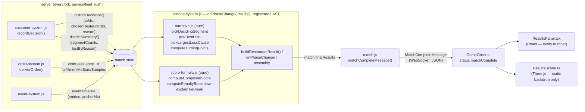

# Design — Results screen narrative layer

Continues the repo's running Decision numbering — the highest existing number found across
`openspec/changes/*/design.md` is Decision 42 (`ingredient-inventory-and-restocking`), so this
file starts at Decision 43.

## Context

STORY-013 (`scoring-system.js`, `score-formula.js`) already produces every §11 numeric results
field and a composite score, but discards two things this story needs: the score formula's own
per-component breakdown (`computeCompositeScore` already returns `components`; STORY-013's
`buildRestaurantResult` destructures only `{ score }`), and `tieBreak` itself, which is stripped
before the wire-facing `MatchResult` is built.

Independently, `customer-system.js` already retains a full per-party §17 decision log
(`match.districtDecisions`) and a per-restaurant `lostByReason`/`segmentCounts` roll-up
(`match.districtSummary`), both published live every tick during `service`/`final_rush` and
republished, un-cleared, at the `results` transition — explicitly for this story: "PRD §17 step
6 is 'post-match explanation', so the decision record must OUTLIVE the simulation state that
produced it. STORY-014 reads these two at `results`." Nothing about this change adds a new
per-tick accumulator to reach that data; it was already there.

The one genuine gap: no system tracks how long a specific DISH took to reach a table.
`order-system.js`'s `dishSales` map has `count`/`revenue` only. This story adds the one new
accumulation the change needs.

## Goals / Non-Goals

**Goals:**
- Every §11 results field renders on the client, sourced verbatim from `match_complete`.
- The narrative sentences (deciding segment, best dish, rival's largest loss cause, tie-break
  explanation) are built from SINGULAR, already-selected server values — the client does string
  templating, never a `.reduce`/`.sort`/`.find` over an array to pick a "winner" itself.
- "Key turning points" — the one §11 results bullet STORY-013 explicitly left unbuilt — gets an
  honest, non-fabricated definition and a bounded (`RESULTS_TURNING_POINTS_MAX`) list.
- A tied match states which tie-break criterion decided it, when one did.

**Non-Goals:**
- No live per-tick score/momentum sampler. `scoring-system.js`'s "owns no simulation state of
  its own" header claim stays true; see Decision 44 below for why a sampler was rejected in
  favor of reconstructing turning points from the existing decision log.
- No literal reproduction of the PRD §11 prose example's exact vocabulary ("lost 11 customers to
  queue abandonment"). That specific example names a POST-COMMITMENT exit mechanic (a party's
  patience running out in the queue) which the codebase does not currently attach a §17 decision
  reason to, or a retained timestamp for — Notable Pattern 9 forbids inventing one. This change
  answers the same AC bullet ("largest single loss cause, tied to the event that caused it")
  with the closest data that already exists honestly: the largest bucket of the §17
  DISTRICT-CHOICE reasons (`lostByReason`) a restaurant lost parties to, cross-referenced against
  the event timeline the same way `countCriticFailures` already does. See Decision 45.
- No dedicated "critic party" or exit-timestamp accumulation for ABANDON_QUEUE/CANCEL_ORDER/
  LEAVE_ANGRY. Adding that would be a second, separate story's worth of new server-side state
  (a timestamped exit log per exit-state, mirroring `badMomentsMs`) — out of scope here per the
  same "closest honestly-available data" principle above.
- No ranking/derivation logic duplicated on the client. `ResultsPanel.tsx` never re-sorts a
  dish list to find the fastest one, or re-tallies a segment breakdown to find the largest
  differential — every one of those is a single already-computed field on the payload.

## Decisions

## Decision 43 — Score/penalty breakdown are read back out, not recomputed

`computeCompositeScore` already computes `components` (`revenueScore`, `guestsServedScore`,
`satisfactionScore`, `reputationBonus`, `eventObjectiveBonus`, `penaltyScore`) — STORY-013's own
`buildRestaurantResult` just never kept them. This change destructures
`{ score, components: scoreBreakdown }` instead of `{ score }`, and adds one sibling pure
function, `computePenaltyBreakdown`, returning the same five per-term products
`computePenaltyPoints` already sums into a scalar — a copy of that function's arithmetic, not a
refactor of it, so `computePenaltyPoints`'s existing contract (consumed by `scoring-system.js`
for the actual score subtraction, and by `scripts/check-scoring.mjs`) never moves.

**Alternative rejected**: changing `computePenaltyPoints`'s return shape to `{ total, breakdown
}}` and updating both call sites. Rejected because it turns an additive change into an
edit-in-place of a function two other things already depend on, for no benefit — a sibling
function costs one more export, not a migration.

## Decision 44 — Turning points are reconstructed retroactively from the decision log, not sampled live

The obvious implementation samples a score-like differential every N milliseconds while the
match runs. This change does not do that. `match.districtDecisions` already carries an `atMs`
and a `chosenRestaurantId` for every party's restaurant choice, in order, un-cleared at
`results`. Cumulative party-acquisition margin (this restaurant's chosen-count minus the
rival's, running) IS a momentum curve — reconstructable after the fact with zero new state.

`narrative.js#computeTurningPoints` draws window boundaries at every event's `activateAtMs`/
`endAtMs` (converted to absolute `elapsedMs` via `match.eventTimeline.anchorMs`, the identical
conversion `scoring-system.js#countCriticFailures` already uses) plus the first and last
decision's own timestamp, so every window is either entirely inside one event or entirely in a
gap. Each window's swing is `margin(windowEnd) − margin(windowStart)`; the top
`RESULTS_TURNING_POINTS_MAX` by `|swing|` are kept, each tagged with the event active at its
midpoint (or, absent an event, the service/final_rush phase — computed from
`match.eventTimeline.anchorMs + match.durations.service`, the exact absolute instant
`final_rush` began, itself free to derive since `anchorMs` already marks when `service` began).

**Alternative considered**: a periodic sampler inside `scoring-system.js#update()`, à la a
`match._scoringNarrativeState`. Rejected for three reasons: it breaks that file's own
"THIS FILE OWNS NO SIMULATION STATE OF ITS OWN" header guarantee for no real gain; it needs a
new tuning constant (sample interval) whose value would be an unmeasured guess; and "guests
served" or "net revenue" were the only two live-every-tick proxies available anyway (order
revenue is not published live, only at `results`) — the SAME proxy quality as the decision-log
reconstruction, at strictly higher implementation and testing cost.

## Decision 45 — "Largest loss cause" answers with the district-choice reason, not the exit-state category

See the Non-Goals section above for the full reasoning. Concretely:
`largestLossCause` is computed from `district.lostByReason` (already tallied by
`customer-system.js#recordDecision` against a restaurant every time a party chose the RIVAL, or
chose to leave without picking anyone, keyed by the same §17 reason vocabulary
`decisionReason` uses elsewhere) — the largest non-zero bucket, cross-referenced against
`match.eventTimeline` for a MAJORITY (`> 50%`, not "any overlap") of that bucket's own
timestamped decisions. Majority, not any-overlap, specifically because "any overlap" is
`countCriticFailures`'s definition for a DIFFERENT question (did anything bad happen at all
during a critic window); reusing it here would tag an event onto a handful of coincidental
timestamps and fabricate a causal story the data does not support.

## Decision 46 — `ResultsScene.ts` renders nothing derived from match data

Per PRD §11's own "nothing is recomputed client-side" and Notable Pattern 11's React/Three.js
split, `ResultsScene.ts` is deliberately a STATIC backdrop (fixed lights, two fixed-size podium
meshes) with no props, no `update(matchResult)` method, and no dimension computed from a score
or count. Every number lives in `ResultsPanel.tsx`. This forecloses the tempting-but-wrong
"podium height scaled by score" feature before it can quietly become a second, client-side
scoring opinion.

`SceneManager` gains one new field (`results: ResultsScene`) and one method
(`setActiveScene('results' | 'other')`), called once per `match_snapshot` on a phase change —
not per frame — mirroring the existing `prompt`/`nearUpgradeTerminal` "patch on change, not on
every snapshot" discipline already in `GameClient.ts`.

## Data flow

## Risks / Trade-offs

- **[Risk]** The district-choice-reason interpretation of "largest loss cause" (Decision 45)
  answers a related but not textually identical question to the PRD's own worked example. →
  **Mitigation**: documented explicitly here and in the story's post-hoc implementation notes,
  so a later story that adds exit-state timestamp tracking can extend `largestLossCause` (widen,
  never rename) rather than rediscovering this trade-off from scratch.
- **[Risk]** `turningPoints`' "margin" proxy (decision count, not revenue or the real composite
  score) can occasionally disagree with a viewer's intuition of "who was winning" if one
  restaurant's parties are worth far more on average. → **Mitigation**: the AC explicitly
  sanctions a simpler, honestly-derived proxy over recomputing the composite score at arbitrary
  instants (which nothing samples live); the field is documented in `messages.d.ts` as a
  party-acquisition margin, not a score.
- **[Risk]** `pickLargestLossCause`'s 50% majority threshold is a fixed, unmeasured cutoff, not
  a tuned constant. → **Mitigation**: kept as a literal in `narrative.js` rather than promoted
  to `tuning.js`, since it is a definitional threshold ("what counts as caused by"), not a
  balance lever a designer would ever want to move independently of the definition itself.

## Migration Plan

Purely additive (Decision 7 "widen, never rename"): no existing `MatchResult`/
`MatchCompleteMessage` field changes shape or meaning. No data migration — match results are not
persisted (Decision: in-memory only, MVP). No client/server version skew concern beyond the
usual "redeploy both together" the repo already assumes; an old client reading a new payload
still gets every field it previously read, unchanged.
