# Design — Solo bot match menu flow

Decisions continue the repo-wide numbering (last was Decision 52, `private-invite-lobby`).

## Context

`server/src/game/match-manager.js#createRoom` + `server/src/game/bot/bot-controller.js
#attachBot` already build a real two-seat authoritative match with a server-controlled second
player — `POST /api/dev/match` (STORY-017) calls exactly that sequence and nothing else. STORY-024
already widened `POST /api/rooms` from a bare dev endpoint into a `mode`-discriminated one
(`private_human` mints an invite). `server/src/game/match.js#toSnapshot` builds the per-viewer
wire snapshot from `Match` state alone — it has never known a bot exists, because a bot lives on
`room.bots`, one level up, by the "bot is a client, not a privileged branch" design STORY-017
already committed to. This change adds the player-facing MENU path onto all three of those
existing seams, without redoing any of them.

See proposal.md for the full motivation; this document is the how.

## Goals / Non-Goals

**Goals:**
- Reuse `matchManager.createRoom` + `attachBot` verbatim for the new menu path — the same
  sequence `POST /dev/match` already runs, not a second attachment mechanism.
- Keep `POST /dev/match`'s existing wire contract, including its "the human client cannot tell
  from the protocol that the opponent is a bot" property (STORY-017 AC1), completely unchanged.
- Give the menu's bot-profile picker real, distinct configurations to choose between, sourced
  from the same `normalizeBotDifficulty` gate the server already has — never a second enum.
- Let the "market scenario" field in the menu actually choose a market, without disturbing the
  seeded reproducibility every other system already depends on.

**Non-Goals:**
- Any change to `bot-controller.js`'s decision loop, target selection, or mistake/AI logic —
  only the DATA it is parameterized by (which of five difficulty ids) is widened.
- A server-side development/production environment gate. This codebase has none today; see
  Decision 58.
- A bot-vs-bot spectator mode, matchmaking queue, or persisted match history.

## Decisions

### Decision 53 — `mode: "solo_bot"` widens `POST /api/rooms`'s existing discriminator, not a new endpoint or a `bot: true` flag on it

STORY-024 already turned `POST /api/rooms` into a `mode`-branching endpoint (`'dev'` |
`'private_human'`). Adding `'solo_bot'` as a third branch follows that exact precedent — the
handler already switches on `mode`, and `roomStatus()` already reports it generically via
`room.mode`. The alternative the story's own notes explicitly allow — reusing `POST /dev/match`
directly from the menu — was rejected because that endpoint's name, doc comments, and
`smoke-bot.mjs`'s own STORY-017 framing all treat it as development/testing-only; routing real
player traffic through it would blur that boundary for anyone reading the code later. A bare
`{bot: true}` flag on the existing default (`mode` omitted) branch was also considered and
rejected: `bot: true` with no `mode` would have to coexist with `private_human`'s own
`hostDisplayName` branch in the same `if`-chain, and would not get its own `room.mode` value for
`buildSnapshot` (Decision 56) to gate on without inventing a second flag just for that.

`POST /dev/match` is untouched and keeps existing for developers and every `scripts/check-*.mjs`
caller — this is an additive sibling, not a replacement.

### Decision 54 — Three real new `BOT_DIFFICULTIES` members, not a label table over the existing two

The menu needs Balanced/Fast Service/Premium as genuine, distinct choices. The alternative —
keep only `easy`/`hard` and map all three menu labels onto `hard` — was rejected for two
reasons: (1) it produces a picker where three of four choices are behaviorally identical,
which is not configuration; (2) a client-side `{label -> difficulty}` mapping table that
collapses several ids into one underlying value would itself be the "parallel enum next to
`normalizeBotDifficulty`" the story's own notes forbid — a hidden second source of truth about
what the bot can be, just moved into a lookup table instead of an array literal. Adding three
real members instead means `normalizeBotDifficulty` (unchanged) stays the only gate, and
`BOT_DECISION_INTERVAL_MS`/`BOT_MISTAKE_PROBABILITY`/`BOT_SPRINT_ENABLED` each get their own
entry so every offered profile actually plays differently — see `shared/constants/tuning.js`'s
own STORY-025 comment for the exact values and reasoning per profile.

`easy` and `hard` (STORY-017's own two) and `BOT_DEFAULT_DIFFICULTY` are untouched, so every
existing caller of `POST /dev/match` and every `scripts/check-bot.mjs` assertion keeps observing
byte-identical values.

### Decision 55 — The market draw always happens; an override only substitutes its RESULT

`Match#generateConfig` draws `marketDraw` from the seed stream, then `spawnJitter` right after
it — draw ORDER is part of the reproducibility contract (existing comment: "Inserting a draw
ABOVE an existing one changes every match with the same seed"). The `marketId` override
therefore still calls `this.rng()` for the market draw unconditionally, and only swaps in the
override's market afterward if it names a real catalogue entry. The alternative — skip the draw
entirely when an override is given — was rejected because it would shift `spawnJitter`'s draw
index (and any future draw after it) specifically for overridden matches, making "reproducible
from the seed" depend on whether a menu screen happened to override the market, which is exactly
the kind of coupling `createRngStream`'s own naming convention exists to avoid elsewhere.

### Decision 56 — Bot identity rides the wire through a `match-manager.js` wrapper, gated on `room.mode`, never through `Match` itself

`match.js`'s own header is explicit that it holds no gameplay-adjacent policy and that later
stories integrate as systems or through data attached to `room`, not by editing it — this is
why `room.bots` already lives outside `Match` (STORY-017). `matchManager.buildSnapshot(room,
viewerId)` wraps `Match#toSnapshot` and merges in `room.bots` — but ONLY when `room.mode ===
'solo_bot'`. This gate is load-bearing, not stylistic: `smoke-bot.mjs`'s own comment on `POST
/dev/match` states plainly that "What must never happen is the [bot] marker reaching a WebSocket
message" — merging `bots` into every room's snapshot unconditionally would silently break that
STORY-017 guarantee for every existing dev/bot room the instant this change shipped.
`simulation-loop.js`'s one production broadcast site now calls `buildSnapshot` instead of
`room.match.toSnapshot` directly; `scripts/check-bot-menu.mjs` calls the same function, so the
shape a check exercises and the shape a client receives cannot quietly diverge.

**Alternative considered:** always include `bots` (empty array for non-bot rooms). Rejected —
"empty vs. absent" is not the actual risk; a bare dev/bot room with an attached bot would still
get a *non-empty* `bots` array under an unconditional merge, which is precisely what STORY-017's
guarantee forbids.

### Decision 57 — The menu's dev-only "Practice" profile is a label over the existing `easy` value, not a sixth `BOT_DIFFICULTIES` member

`easy` already behaves like a low-pressure, practice-grade opponent (`BOT_MISTAKE_PROBABILITY
.easy` misses about a third of its own opportunities, `BOT_SPRINT_ENABLED.easy` is `false`) and
already exists as `BOT_DEFAULT_DIFFICULTY`. Adding a distinct `practice` member with identical
or near-identical tuning would be an enum entry justified only by wanting a friendlier display
name — exactly the kind of gap Decision 54 argues against creating elsewhere. Instead,
`client/src/ui/bot-profiles.ts` maps the existing `easy` id to the label "Practice" and marks it
`devOnly`, gated out of the picker by `import.meta.env.DEV` (a production build never offers it).
The three genuinely new profiles (Decision 54) are the only real additions to the server's own
enum.

### Decision 58 — No server-side development/production gate is introduced

The "Practice" profile and the fixed-seed input are hidden from a production-BUILT client, but
nothing on the server refuses a `botDifficulty: "easy"` or an explicit `seed` from any caller —
this repo has no `NODE_ENV`-style server/production distinction anywhere today, and `POST
/dev/match` itself already accepts any difficulty and any seed from any caller unconditionally,
in every environment, by design. Inventing a new authority boundary here, for these two fields
alone, would be new infrastructure well outside this change's scope. This is the same "MVP trust
level" already documented for the reconnect token and the invite-cancel endpoint: the client-side
gate is a UX affordance, not a security boundary, and is called out here explicitly rather than
silently assumed.

## Data Flow

The new sequence this change adds — a player configuring and starting a bot match from the menu,
through to the results screen naming the bot, and the abandonment path:

```mermaid
sequenceDiagram
    participant M as MainMenu.tsx
    participant P as PlayVsBotScreen.tsx
    participant HTTP as routes.js<br/>POST /api/rooms
    participant MM as match-manager.js<br/>createRoom + buildSnapshot
    participant BOT as bot-controller.js<br/>attachBot
    participant SIM as simulation-loop.js<br/>(real broadcast loop)
    participant G as GameClient.ts<br/>+ HudPanel/ResultsPanel

    M->>P: "Play vs Bot" clicked -> opens configuration screen
    Note over P: GET /api/markets (scenario names)<br/>profiles from bot-profiles.ts<br/>(devOnly hidden outside import.meta.env.DEV)

    P->>HTTP: POST /api/rooms<br/>{mode: "solo_bot", botDifficulty, marketId?, seed?}
    HTTP->>MM: createRoom({..., mode: "solo_bot", marketId})
    MM-->>MM: new Match({marketId})<br/>market draw always runs (Decision 55)<br/>override substitutes the result if valid
    HTTP->>BOT: attachBot(room, {difficulty})
    BOT->>BOT: join_room -> routeMessage()<br/>(same path a real browser's first frame uses)
    Note over BOT: bot seated BEFORE the HTTP response returns —<br/>identical to POST /dev/match's own guarantee
    HTTP-->>P: 201 {id, bot: true, botDifficulty, ...roomStatus}
    Note over P: navigate('/game/:roomId') — the normal route,<br/>same lifecycle any other match uses

    P->>G: GameClient.start(roomId) — join_room over /ws (second, human, seat)
    G->>SIM: (joins the room's socket set)

    loop every BROADCAST_MS
        SIM->>MM: buildSnapshot(room, viewerPlayerId)
        alt room.mode === "solo_bot"
            MM-->>SIM: snapshot + bots: [{playerId, difficulty}]
        else room.mode === "dev" / "private_human"
            MM-->>SIM: snapshot, UNCHANGED (no bots field — STORY-017 AC1 intact)
        end
        SIM-->>G: match_snapshot
    end
    Note over G: status.bots feeds HudPanel/TacticalOverviewPanel<br/>("Bot (Premium)" instead of generic "Rival")

    G-->>G: match reaches match_complete
    Note over G: ResultsPanel reads status.bots to label<br/>the opponent column by profile, not "Rival"

    rect rgb(40, 30, 30)
    Note over G: Alt path: the human abandons the match
    G--xSIM: human's socket closes
    SIM->>MM: Match#removePlayer(humanPlayerId)<br/>(the SAME call a human-vs-human drop makes —<br/>nothing bot-specific)
    Note over MM: past RECONNECT_GRACE_MS with no reconnect,<br/>Match#advanceClock ends the match:<br/>endReason: "player_disconnected"<br/>(bot's own seat is untouched throughout)
    end
```

## Risks / Trade-offs

- **The three new profiles' exact tuning values are a judgment call, not measured balance data**
  → Mitigation: they sit strictly between `easy` and `hard` on every knob (or, for
  `fast_service`'s reaction cadence, slightly past `hard` — the one profile whose name is
  specifically about speed), reusing the exact same three knobs STORY-017's own balance testing
  already validated the shape of; a later story can retune the numbers without touching this
  one's structure.
- **No server-side gate on the dev-only fields (Decision 58)** → a determined caller can hit
  `POST /api/rooms` directly with `botDifficulty: "easy"` or an explicit `seed` in any
  environment. Mitigation: this is the same trust level `POST /dev/match` already has for both
  fields, explicitly documented rather than silently assumed; the blast radius is "an easier
  practice bot or a chosen seed," never money/score/inventory authority.
- **`buildSnapshot`'s `room.mode === 'solo_bot'` gate is a single string comparison a future
  change could accidentally widen** → Mitigation: `scripts/check-bot-menu.mjs` asserts the gate
  directly (a bare dev/bot room's snapshot has no `bots` key at all), and
  `scripts/smoke-bot-menu.mjs` re-asserts it over a real socket — a regression here fails loudly
  in `npm run check`, not silently in production.

## Migration Plan

Purely additive: a new `mode` branch on an existing endpoint, three new array/object entries on
existing tuning tables, one new optional `Match` constructor parameter, and a new wrapper
function at the one production snapshot call site. No existing caller's request or response
shape changes. No data migration: rooms are in-memory and not persisted, so there is nothing
stored in the old shape to reconcile. Rollback is reverting the branch; nothing here is a one-way
door.
